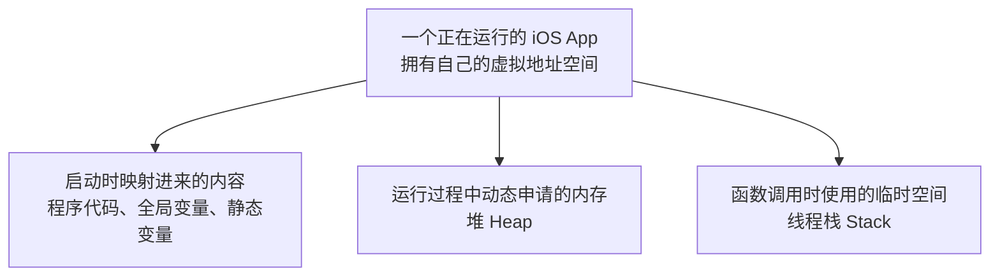

# iOS 内存地图：从虚拟地址空间、堆栈到 Memory Footprint

## 前言

在之前的文章中，笔者完成过两篇内存管理的入门文章：

- [【iOS】内存五大分区](https://www.tommywutong.cn/blog/csdn-import/csdn-154609757-ios-/)
- [【iOS】内存管理初级](https://www.tommywutong.cn/blog/csdn-import/csdn-152130856-ios-/)

受限于当时的知识面，这两篇文章对很多概念的理解较浅，部分表述也不够严谨。现在重新梳理 iOS 底层知识，希望从操作系统的虚拟内存出发，把“变量在哪里”“对象在哪里”“堆和栈是什么”“Mach-O 的 Segment 又是什么”“系统如何统计和回收内存”这些容易混在一起的问题逐层分开。

## 本文主线

这篇文章会同时讨论地址空间和内存占用，但二者不能混在同一个层级中。全文按照下面的顺序展开：

```text
操作系统为什么需要虚拟内存
        ↓
一个 iOS App 获得怎样的虚拟地址空间
        ↓
用“五大分区”建立一张用途地图
        ↓
Mach-O、堆和线程栈分别怎样形成这些区域
        ↓
用代码和 LLDB 验证变量、指针与对象的位置
        ↓
从“地址在哪里”过渡到“实际占用多少”
        ↓
理解 Clean、Dirty、Compressed 与 Memory Footprint
        ↓
理解内存警告、压缩与 Jetsam
```

这里涉及三个不同的观察层级：

| 观察层级 | 主要回答的问题 | 典型概念 |
| --- | --- | --- |
| 进程地址空间 | 这段地址用来做什么 | VM Region、代码、数据、堆、栈 |
| 可执行文件与运行时 | 这段内容从哪里来 | Mach-O、`malloc`、线程栈 |
| 物理页面与系统记账 | 它现在是否占用宝贵的内存资源 | Clean、Dirty、Compressed、Memory Footprint |

同一份数据可以同时被这三个层级描述。例如，一个全局变量在教学模型中属于全局/静态区，在 Mach-O 中可能来自 `__DATA` 的某个 Section，运行后所在页面还可能被记为 clean 或 dirty。它们不是互相竞争的三种答案，而是从不同角度描述同一件事。

---

## 第一部分：从操作系统到 iOS 地址空间

### 操作系统中的内存

在没有内存保护和地址转换机制的环境中，程序直接使用物理地址。多个程序如果使用了相同的地址，就可能互相覆盖数据。虽然系统也可以依靠人工规划固定的物理地址来运行多个程序，但这种方式难以做到可靠隔离、灵活装载和高效共享。

现代操作系统因此让进程主要使用虚拟地址，并由硬件和内核共同完成从虚拟地址到物理页的映射。不同进程中的同一个虚拟地址可以映射到不同的物理页；内核也可以通过权限控制，阻止进程访问不属于自己的映射。


- **虚拟内存（Virtual Memory）**：操作系统提供给进程的一层地址空间抽象。一个 iOS App 看到的是自己独立的虚拟地址空间，其中包含多个离散的虚拟内存区域（VM Region）。虚拟地址空间很大，但并不意味着其中每个地址都有效，也不意味着所有已映射页面都同时驻留在物理内存中。


- **物理内存（Physical Memory）**：设备真实存在、可由 CPU 访问的 RAM。进程访问虚拟地址时，CPU 的 MMU 会依据页表把它转换为对应的物理地址。

操作系统教材通常通过“分段”和“分页”两条路线介绍地址空间管理。对现代 arm64 iOS 来说，后文真正需要继续使用的是分页、页表、权限和 VM Region；分段主要帮助理解历史模型和逻辑区域。

#### 分段


分段（Segmentation）是一种经典的内存管理思想：按照代码、数据、栈等逻辑单元描述地址空间，各段长度可以不同。它有助于理解“程序可以由不同用途、不同权限的区域组成”。

但这里必须区分三个名字相似、含义不同的概念：

- 操作系统教材中的 **Segmentation** 是一种地址转换和内存管理模型。
- Mach-O 中的 `__TEXT`、`__DATA` 等 **Segment** 是可执行文件及其装载映射的组织方式。
- 堆和栈是进程运行时使用的虚拟内存区域，不是“编译器创建的 CPU 分段”。

现代 arm64 iOS 的内存管理重点是分页和 Mach VM。后文讨论 Mach-O 时，还需要进一步观察 `__TEXT`、`__DATA` 等文件布局如何被映射为进程中的 VM Region。

#### 分页


为了方便映射和管理，虚拟内存和物理内存都被分割成相同大小的单位，物理内存的最小单位被称为帧（Frame），而虚拟内存的最小单位被称为页（Page）。
Apple 当前文档指出，iOS 中典型的页大小是 16 KB；具体值仍应以设备和运行环境为准，可以通过 `vm_page_size`、`getpagesize()` 或 Jetsam Event Report 中的 `pageSize` 字段确认，而不应在程序逻辑中写死。

- **页表（Page Table）**：记录虚拟页到物理页的映射及读、写、执行等权限。代码访问虚拟地址时，CPU 内部的 **MMU（Memory Management Unit）** 会依据页表完成地址转换。
- **虚拟内存区域（VM Region）**：一段具有相同属性的连续虚拟地址范围。一个进程拥有许多 VM Region，但整个虚拟地址空间并非从头到尾连续有效。

关于分页、页表和地址转换的更多细节，可以继续阅读：[深入理解虚拟内存]([https://juejin.cn/post/6844903902169710600?searchId=202607242005413F8E66D396B122E9CEF3#heading-0](https://www.xiaolincoding.com/os/3_memory/vmem.html#%E8%99%9A%E6%8B%9F%E5%86%85%E5%AD%98))。本文暂时停在能够支撑后续 iOS 地址空间分析的程度。


### 从操作系统过渡到 iOS App

一个运行中的 iOS App，本质上就是一个进程。系统会为它提供独立的虚拟地址空间。前文讨论的分页、页表和 VM Region，在这里不再只是操作系统教材中的抽象概念，而是 App 代码实际运行的环境。



这里需要提前建立一个边界：常说的“代码区、数据区、堆区、栈区”是一张便于入门的教学地图，并不是 Darwin/iOS 对全部 VM Region 的完整分类。真实进程还会包含动态库、共享缓存、匿名映射、内存映射文件、线程相关区域等；同一个大类内部也可能因为权限和用途不同而被拆成多个 Region。

### 先用“五大分区”建立用途

面试中常说的“五大分区”，可以先整理为下面这张教学地图：

| 教学分区 | 主要内容 | 在真实 iOS 中继续追问 |
| --- | --- | --- |
| 代码区 | 编译后的机器指令、函数代码 | 通常来自 Mach-O 的可执行、只读映射 |
| 常量区 | 字符串字面量、部分只读常量 | 可能位于 Mach-O 的只读 Section |
| 全局/静态区 | 全局变量、静态变量 | 根据是否初始化、是否可写，进入不同的数据 Section |
| 堆区 | 运行时动态申请的数据 | 通常由 `malloc` 等分配器管理多个 VM Region |
| 栈区 | 函数调用期间的临时状态 | 每个线程拥有自己的线程栈 |

这张表先解决“源代码里的东西大概放在哪里”。接下来再分别追问：前三类如何由 Mach-O 带入进程，堆如何在运行时增长，栈为什么属于线程。

> [!todo]
> 用一段同时包含函数、字符串字面量、全局变量、静态变量、局部变量和 `malloc` 的示例代码，逐项填写上表。不要只给出结论，还要说明编译优化和运行时实现带来的例外。

### Mach-O：解释启动时映射进来的代码和数据

Mach-O 不是“五大分区”之外的第六个分区。它是 iOS 可执行文件的组织格式，用来解释 App 启动前代码和全局数据保存在什么地方，以及启动后如何被映射进虚拟地址空间。

目前只需要先建立下面的关系：

| 五大分区中的说法 | Mach-O 与虚拟内存视角 |
| --- | --- |
| 代码区 | 机器指令通常来自 `__TEXT` Segment 中的相关 Section |
| 常量区 | 字符串和部分只读常量通常来自只读 Section |
| 全局/静态区 | 已初始化数据、零填充数据等来自 `__DATA` 及相关 Segment/Section |

Mach-O 的 Segment 描述可执行文件及装载映射的组织方式；操作系统教材中的 Segmentation 描述的是一种地址管理模型。二者名字相似，但不能混为一谈。

> [!todo]
> 精读本地 [[20 专题笔记/编译链接与启动/Mach-O|Mach-O]]，先补充 Segment、Section、`__TEXT`、`__DATA` 和映射权限。Mach Header、Load Commands、dyld Rebase/Bind、共享缓存等细节留到后续 Mach-O 专题。

### 堆与线程栈：解释运行过程中出现的区域

Mach-O 主要解释启动时已经存在的代码和数据。App 开始运行后，动态申请的数据通常进入由内存分配器管理的堆区域；函数调用则会使用当前线程自己的栈。

- **堆**：不是一整块固定且永远连续的区域。`malloc` 等分配器会管理一个或多个虚拟内存区域，并把合适的空间交给调用方。
- **线程栈**：每个线程都有自己的栈，用来支撑函数调用和临时状态。多个线程共享进程的代码、全局数据和堆，但不共享同一个线程栈。
- **局部变量**：在未优化的直觉模型中经常位于栈帧；经过编译优化后，也可能只存在于寄存器中。

### 指针变量和对象本体分别在哪里

> [!todo]
> 回到开头的代码，分别解释变量本身保存在哪里、变量中保存的值是什么，以及该值指向的对象本体在哪里。不要只回答“对象在堆上”，还要说明字符串字面量、Tagged Pointer 等例外。

例如，在一个函数中声明 `NSObject *object = [[NSObject alloc] init];` 时：

- 局部指针变量 `object` 具有自动存储期，编译器通常会让它位于当前栈帧中，但经过优化后也可能只存在于寄存器中。
- `object` 保存的是对象地址；普通 Objective-C 对象通常由运行时在动态分配区域中创建。
- `&object` 表示指针变量本身的地址，`object` 表示其保存的对象地址，两者不是同一个概念。
- 并非所有看起来像对象的值都对应一次普通堆分配，例如字符串字面量和 Tagged Pointer。

### 用 LLDB 验证地址分布

> [!todo]
> 在 Debug 构建中记录实验环境，再使用 LLDB 比较局部变量、全局变量、静态变量、字符串字面量、普通对象及其指针变量的地址。将“预期—命令—结果—解释”整理成表格，并说明编译优化可能改变局部变量的实际位置。

可以从这些命令开始：

```lldb
p/x &localVariable
p/x &globalVariable
p/x object
p/x &object
image list
```

地址本身只是一条线索。还需要结合 `image list`、`vmmap`、Mach-O 布局和 Region 权限，才能解释一个地址属于哪类映射。

> [!todo]
> 结合 `vmmap` 或 Xcode Memory Report，画出当前实验 App 的内存地图。至少标出：主程序与动态库映射、全局与静态数据、堆、各线程的栈、共享缓存和其他内存映射。

---

## 第二部分：从“在哪里”到“实际占多少”

前半篇建立的是地址空间地图，但“申请了多大的虚拟地址范围”和“App 当前为多少物理内存负责”不是同一个问题。下面开始把观察单位从变量和 VM Region 切换为内存页。

### 申请内存不等于立刻产生等量的 Memory Footprint

Apple 在 WWDC18《iOS Memory Deep Dive》中以典型的 16 KB 页面说明：内存系统以页为粒度管理和统计资源，一个页面可以容纳多个堆对象，一个对象也可能跨越多个页面。因此，哪怕程序只修改其中一个字节，受影响的仍可能是整个页面。

这里不能把“内存使用量”笼统地理解为所有虚拟地址范围。虚拟地址空间大小、当前驻留的物理页、堆分配量和系统用于限制 App 的 Memory Footprint 是不同指标。后文所说的 footprint，重点关注 App 需要系统保留的 dirty 与 compressed 页面，而 clean 页面可以从原始来源重新建立，因此记账方式不同。


以 `malloc` 为例，申请一段空间与真正触碰其中的每一个页面并不是同一个动作。分配器可能先为程序准备可用的虚拟地址；当程序首次访问相应页面时，系统才按需建立页面支持。实际变化还会受到页面是否已经存在、写入是否落在同一页以及分配器元数据等因素影响，所以不能机械地推导出“每写一个字节，内存就一定增加 16 KB”。

当 App 开始写入页面时，相关页面可能从 clean 变为 dirty。下面这张图描述的是“已分配”和“已写入”在页面状态上的区别，而不是五大分区中的新区域。


### Clean、Dirty 与 Compressed

- **Clean memory**：内容可以从原始来源重新构造或重新读取的页面。例如，未被修改的 Mach-O、Framework 和其他文件映射页面通常可以在需要时丢弃。Clean page 当前也可能驻留并占用 RAM；它的关键特点是可重新建立，而不是“永远不占物理内存”。
- **Dirty memory**：内容已经被进程修改，不能直接丢弃并靠原文件恢复的页面。堆上的对象、解码后的图像缓冲区等通常会贡献 dirty memory，但内存按页记账，分配与实际写入仍要分开观察。
- **Compressed memory**：系统压缩后暂时保留的页面。它减少当前物理占用，但数据没有被释放，仍应纳入 App footprint 的分析。

新获得的页面可能最初仍是 clean；当程序真正写入页面时，页面才会变 dirty。非可丢弃的 dirty page 不能像 clean 文件页那样直接回收，但系统可以压缩它，或者在压力无法缓解时终止相关进程。

### iOS 内存压力与回收

#### iOS 没有传统意义上的磁盘 Swap

桌面操作系统通常可以把一部分匿名内存换出到磁盘。Apple 的 iOS 虚拟内存资料和 WWDC18《iOS Memory Deep Dive》强调：iOS 不把普通 App 的 dirty page 当作传统磁盘 swap 的后备存储来使用。

这不等于“iOS 的虚拟内存从不读取存储设备”。App 的可执行文件、动态库和内存映射文件本来就可以按需 page in；clean 的文件映射页被丢弃后，也可以在需要时重新读取。对于 App 开发，关键区别是：不能期待系统把不断增长的匿名 dirty memory 像桌面 swap 一样长期换出，从而替应用兜底。

系统实现会随版本演进，因此比起把原因简单归结为“保护闪存寿命”，更稳妥的结论是：iOS 的内存策略优先考虑移动设备的性能、能耗和系统响应，并通过回收可重建页面、内存压缩以及必要时终止进程来控制压力。

#### 内存压缩

当物理内存紧张时，系统可以压缩近期不活跃的页面，以减少它们占用的物理空间；再次访问时再进行解压。压缩和解压会消耗 CPU，说明内存压力也可能转化为性能与能耗开销。

需要注意：被压缩的内存并没有从 App 的内存责任中消失。理解和分析 footprint 时，应同时关注 dirty memory 与 compressed memory，不能把“已压缩”等同于“已释放”。

#### Memory Warning 与 Jetsam

系统处于内存压力时，UIKit 可以通过 App Delegate、View Controller 或通知等途径向 App 传递低内存警告。这个警告反映的是系统级压力，不一定仅由当前 App 导致，也不能保证每次被终止前都严格经历同一条回调链。

如果压力持续、进程超过相应内存限制，或系统需要迅速回收资源，系统可能终止一个或多个进程。开发者随后可能看到 **Jetsam Event Report**。它不同于由异常或信号产生的常规 crash report，因此把这种终止简单写成“Jetsam 先发送 `didReceiveMemoryWarning`，App 不处理后再杀死”并不准确。

循环引用会让对象生命周期超出预期，持续占用它们关联的内存；这属于内存泄漏和对象所有权问题。解码后的大图也可能快速抬高 dirty memory 峰值。二者都值得优化，但不能由此推出“所有 Objective-C 对象都一直占据物理内存，直到手动释放”。

### 回到“五大分区”：把三个观察层级重新合并

> [!todo]
> 在完成 LLDB 实验后，重新审视旧文章中的“五大分区”。分别说明它作为教学模型解决了什么问题、遗漏了哪些 VM Region，以及为什么 Mach-O Segment、进程运行时区域和物理页状态不能混为一谈。

最终可以选择几个具体对象，从三个层级同时描述：

| 例子 | 地址空间用途 | 来源或形成方式 | 页面状态与 footprint |
| --- | --- | --- | --- |
| 函数机器指令 | 代码区域 | 从 Mach-O 的只读、可执行映射而来 | 通常是可重新加载的 clean 文件页 |
| 可写全局变量 | 全局/静态区域 | 从 Mach-O 数据 Section 映射而来 | 写入后相关页面可能变为 dirty |
| 普通 Objective-C 对象 | 通常位于堆管理的区域 | 运行时通过分配器创建 | 被实际写入的相关页面通常贡献 dirty memory |
| 函数局部状态 | 当前线程的栈或寄存器 | 随函数调用建立和销毁 | 被写入的栈页面属于 App 需要负责的页面 |

这张表才是全文真正的终点：先判断“在哪里”，再追问“从哪里来”，最后分析“系统怎样为它记账”。  

### 总结

到这里可以得出六个结论：

1. 进程使用的是由多个 VM Region 组成的虚拟地址空间，虚拟地址并不等于物理地址。
2. “五大分区”是一张用途地图，适合建立直觉，但不是 Darwin/iOS 对所有 VM Region 的完整分类。
3. Mach-O 解释启动时的代码和数据如何进入地址空间；堆和线程栈则解释运行过程中出现的动态区域。
4. 回答“变量和对象在哪里”时，必须分别讨论变量本身、变量保存的地址、对象本体以及字面量或 Tagged Pointer 等例外。
5. 虚拟地址范围、堆分配量、驻留物理页和 Memory Footprint 是不同指标，不能只看到一个数字就互相替代。
6. Clean、Dirty、Compressed 描述页面的可重建性和系统记账状态；内存压缩、警告与 Jetsam 则描述系统在压力下采取的策略。


## 参考资料

### 官方资料

- [Apple — About the Virtual Memory System](https://developer.apple.com/library/archive/documentation/Performance/Conceptual/ManagingMemory/Articles/AboutMemory.html)
- [Apple — Reducing your app's memory use](https://developer.apple.com/documentation/xcode/reducing-your-app-s-memory-use)
- [Apple — Responding to memory warnings](https://developer.apple.com/documentation/uikit/responding-to-memory-warnings)
- [Apple — Identifying high-memory use with Jetsam Event Reports](https://developer.apple.com/documentation/xcode/identifying-high-memory-use-with-jetsam-event-reports)
- [Apple — Reduce terminations in your app](https://developer.apple.com/documentation/xcode/reduce-terminations-in-your-app)
- [Apple — Reducing your app's launch time](https://developer.apple.com/documentation/xcode/reducing-your-app-s-launch-time)
- [WWDC18 — iOS Memory Deep Dive](https://developer.apple.com/videos/play/wwdc2018/416/)
- [Apple Kernel Programming Guide — Memory and Virtual Memory](https://developer.apple.com/library/archive/documentation/Darwin/Conceptual/KernelProgramming/vm/vm.html)

### 操作系统资料

- [小林 Coding — 图解操作系统](https://www.xiaolincoding.com/os/)
- [小林 Coding — 为什么要有虚拟内存？](https://www.xiaolincoding.com/os/3_memory/vmem.html)
- [小林 Coding — malloc 是如何分配内存的？](https://www.xiaolincoding.com/os/3_memory/malloc.html)

### iOS 与 Objective-C 延伸

- [Size Matters: An Exploration of Virtual Memory on iOS](https://alwaysprocessing.blog/2022/02/20/size-matters)
- [Mike Ash — Stack and Heap Objects in Objective-C](https://www.mikeash.com/pyblog/friday-qa-2010-01-15-stack-and-heap-objects-in-objective-c.html)
- [Mike Ash — Intro to the Objective-C Runtime](https://www.mikeash.com/pyblog/friday-qa-2009-03-13-intro-to-the-objective-c-runtime.html)
- https://juejin.cn/post/6844903902169710600?searchId=202607242005413F8E66D396B122E9CEF3
- 本地：[[20 专题笔记/编译链接与启动/Mach-O|Mach-O]]
