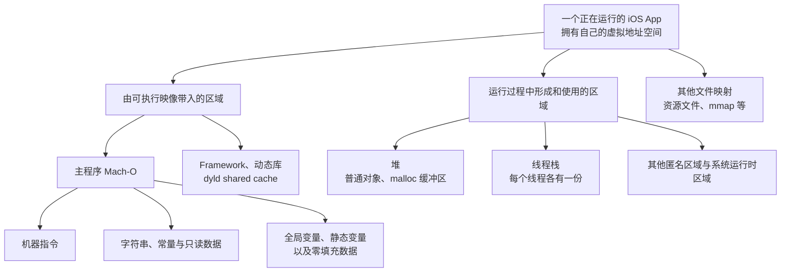
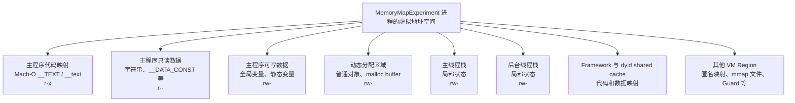

# iOS 内存地图：从虚拟地址空间到 VM Region

## 前言

在之前的文章中，笔者完成过两篇内存管理的入门文章：

- [【iOS】内存五大分区](https://www.tommywutong.cn/blog/csdn-import/csdn-154609757-ios-/)
- [【iOS】内存管理初级](https://www.tommywutong.cn/blog/csdn-import/csdn-152130856-ios-/)

受限于当时的知识面，这两篇文章对很多概念的理解较浅，部分表述也不够严谨。现在重新梳理 iOS 底层知识，希望从操作系统的虚拟内存出发，把"变量在哪里""对象在哪里""堆和栈是什么""Mach-O 的 Segment 又是什么"这些容易混在一起的问题逐层分开。

这篇文章只回答"一段虚拟地址属于哪里、由谁在什么时候放进去的"。这些地址背后的页面此刻是否真的占用物理内存、系统怎样统计和回收，放在系列下一篇 [[iOS 内存：Clean、Dirty、Compressed 与 Memory Footprint]] 里单独展开。

## 本文主线

全文按照下面的顺序展开：

```text
操作系统为什么需要虚拟内存
        ↓
一个 iOS App 获得怎样的虚拟地址空间
        ↓
用"五大分区"建立一张用途地图
        ↓
Mach-O、堆和线程栈分别怎样形成这些区域
        ↓
用 VM Region、内容来源和访问权限回到真实系统
        ↓
用代码和 LLDB 验证变量、指针与对象的位置
```

这里涉及两个不同的观察角度：

| 观察角度 | 主要回答的问题 | 典型概念 |
| --- | --- | --- |
| 用途 | 这段地址用来做什么 | 五大分区、代码、数据、堆、栈 |
| 来源 | 这段内容从哪里来、由谁在什么时候建立 | Mach-O、VM Region、`malloc`、线程栈 |

同一份数据可以同时被这两个角度描述。例如，一个全局变量在教学模型中属于全局/静态区（用途），在 Mach-O 中来自 `__DATA` 的某个 Section、运行时是一个具体的 VM Region（来源）。它们不是互相竞争的两种答案，而是从不同角度描述同一件事。至于这个 Region 现在是否真的占用物理内存、算 clean 还是 dirty，属于系列下一篇的"页面记账"视角，这里先不展开。

---

## 操作系统中的内存

在没有内存保护和地址转换机制的环境中，程序直接使用物理地址。多个程序如果使用了相同的地址，就可能互相覆盖数据。虽然系统也可以依靠人工规划固定的物理地址来运行多个程序，但这种方式难以做到可靠隔离、灵活装载和高效共享。

现代操作系统因此让进程主要使用虚拟地址，并由硬件和内核共同完成从虚拟地址到物理页的映射。不同进程中的同一个虚拟地址可以映射到不同的物理页；内核也可以通过权限控制，阻止进程访问不属于自己的映射。


- **虚拟内存（Virtual Memory）**：操作系统提供给进程的一层地址空间抽象。一个 iOS App 看到的是自己独立的虚拟地址空间，其中包含多个离散的虚拟内存区域（VM Region）。虚拟地址空间很大，但并不意味着其中每个地址都有效，也不意味着所有已映射页面都同时驻留在物理内存中。


- **物理内存（Physical Memory）**：设备真实存在、可由 CPU 访问的 RAM。进程访问虚拟地址时，CPU 的 MMU 会依据页表把它转换为对应的物理地址。

操作系统教材通常通过"分段"和"分页"两条路线介绍地址空间管理。对现代 arm64 iOS 来说，后文真正需要继续使用的是分页、页表、权限和 VM Region；分段主要帮助理解历史模型和逻辑区域。

### 分段


分段（Segmentation）是一种经典的内存管理思想：按照代码、数据、栈等逻辑单元描述地址空间，各段长度可以不同。它有助于理解"程序可以由不同用途、不同权限的区域组成"。

但这里必须区分三个名字相似、含义不同的概念：

- 操作系统教材中的 **Segmentation** 是一种地址转换和内存管理模型。
- Mach-O 中的 `__TEXT`、`__DATA` 等 **Segment** 是可执行文件及其装载映射的组织方式。
- 堆和栈是进程运行时使用的虚拟内存区域，不是"编译器创建的 CPU 分段"。

现代 arm64 iOS 的内存管理重点是分页和 Mach VM。后文讨论 Mach-O 时，还需要进一步观察 `__TEXT`、`__DATA` 等文件布局如何被映射为进程中的 VM Region。

### 分页


为了方便映射和管理，虚拟内存和物理内存都被分割成相同大小的单位，物理内存的最小单位被称为帧（Frame），而虚拟内存的最小单位被称为页（Page）。
Apple 当前文档指出，iOS 中典型的页大小是 16 KB；具体值仍应以设备和运行环境为准，可以通过 `vm_page_size`、`getpagesize()` 或 Jetsam Event Report 中的 `pageSize` 字段确认，而不应在程序逻辑中写死。

- **页表（Page Table）**：记录虚拟页到物理页的映射及读、写、执行等权限。代码访问虚拟地址时，CPU 内部的 **MMU（Memory Management Unit）** 会依据页表完成地址转换。
- **虚拟内存区域（VM Region）**：一段具有相同属性的连续虚拟地址范围。一个进程拥有许多 VM Region，但整个虚拟地址空间并非从头到尾连续有效。

### 按需分页与 Page Fault（缺页中断）

某个虚拟地址落在进程已经建立的合法 VM Region 中，不等于对应页面已经驻留在物理 RAM。系统可以先建立地址范围和映射关系，等程序真正访问某一页时，再提供零填充页、从 Mach-O 或其他映射文件取得内容，或者完成 Copy-on-Write，然后继续执行原来的指令。

CPU 发现现有页表不能直接完成访问时，会触发 Page Fault 并交给内核处理。能够由内核补全映射的 Page Fault 是按需分页的正常机制，并不等同于崩溃；只有地址无效或访问权限冲突且内核无法修复时，才可能最终表现为 `EXC_BAD_ACCESS`。`EXC_BAD_ACCESS` 是非法内存访问的结果之一，不能简单等同于"野指针"。

这里先把 Page Fault 当作一个连接点：它解释了为什么"已经分配或映射虚拟地址"仍不代表"对应物理页已经到位"。系列下一篇讨论 `malloc`、首次写入和 Memory Footprint 时还会再次用到这个结论。Apple 的 [About the Virtual Memory System](https://developer.apple.com/library/archive/documentation/Performance/Conceptual/ManagingMemory/Articles/AboutMemory.html) 对 soft fault、hard fault 和 page-in 有进一步说明。

关于分页、页表和地址转换的更多细节，可以继续阅读：[小林 Coding：为什么要有虚拟内存？](https://www.xiaolincoding.com/os/3_memory/vmem.html)。本文暂时停在能够支撑后续 iOS 地址空间分析的程度。


## 从操作系统过渡到 iOS App

一个运行中的 iOS App，本质上就是一个进程。系统会为它提供独立的虚拟地址空间。前文讨论的分页、页表和 VM Region，在这里不再只是操作系统教材中的抽象概念，而是 App 代码实际运行的环境。




我们首先来讲讲，一个iOS APP是怎样获得内存的以便于后续的理解
### 阶段一：App还没有运行

这时候 App 的代码和数据存放在磁盘上的 Mach-O 文件中。
```
磁盘上的 Mach-O
├── __TEXT：代码、部分只读内容
├── __DATA_CONST：部分只读数据
├── __DATA：可写的全局、静态数据
└── 其他装载和链接信息
```

### 阶段二：用户启动App

系统创建一个进程，并给他一套独立的虚拟地址（非一整块连续的物理内存）空间。然后，内核和dyld根据 Mach-O 里的装载信息，把相关内容映射进虚拟地址空间。与此同时，依赖的系统 Framework、动态库和 dyld shared cache 也会被映射进来。

所以进程的完整虚拟地址空间，远大于主程序自己的 Mach-O。

### 阶段三：用 VM Region 描述这些映射

虚拟地址空间不是一个从头到尾全部有效的大数组，而是有许多离散的 VM Region组成。
一个 VM Region 可以先理解为：
> 一段连续的虚拟地址范围，这段范围具有相近的来源、用途和访问权限。

### 阶段四：App开始运行，堆和线程栈出现

Mach-O 主要解释启动时已经存在的代码和全局数据，但程序运行起来以后，还会不断产生新的内存需求。

- 每创建一个线程，系统都会为这个线程准备自己的栈 Region。
- 当程序执行malloc或创建普通Objective-C对象时，运行时需要动态分配内存 而这些通常来自堆，而堆也不是一整块固定区域，`malloc` 分配器会向系统获得并管理一个或多个 VM Region，再把其中的小块空间分给对象和缓冲区。


### 阶段五：CPU真正访问这些地址

无论一个地址属于代码、全局变量、堆还是栈，程序拿到的首先都是虚拟地址。CPU访问时经过页表查询到物理页，最终得到真实RAM中的数据


# "五大分区"

这就是我们经常提到的五大分区


- **栈区**：创建临时变量时由编译器自动分配，在不需要的时候自动清除的变量的存储区。里面的变量通常是局部变量、函数参数等。在一个进程中，位于用户虚拟地址空间顶部的是用户栈，编译器用它来实现函数的调用。和堆一样，用户栈在程序执行期间可以动态地扩展和收缩。
- **堆区**：那些由 new alloc 创建的对象所分配的内存块，它们的释放系统不会主动去管，由我们的开发者去告诉系统什么时候释放这块内存(一个对象引用计数为0是系统就会回销毁该内存区域对象)。一般一个 new 就要对应一个release。在ARC下编译器会自动在合适位置为OC对象添加release操作。会在当前线程Runloop退出或休眠时销毁这些对象，MRC则需程序员手动释放。堆可以动态地扩展和收缩。
- **未初始化数据（静态区）**：程序运行过程内存的数据一直存在，程序结束后由系统释放
- **已初始化数据（常量区）**：专门用于存放常量，程序结束后由系统释放
- **代码段**：用于存放程序运行时的代码，代码会被编译成二进制存进内存的程序代码区
- **内核区**：用于加载内核代码，预留1GB
- **保留区**：内存有4MB保留，地址从低到高递增


下面用贯穿全文的实验代码把五类内容放在一起：

```objc
int globalInitialized = 11;
int globalZeroInitialized;
static int staticInitialized = 22;
static NSString * const globalStringLiteral = @"global literal";

__attribute__((noinline, optnone))
static void RunMemoryExperiment(void) {
    volatile int localNumber = 33;
    NSObject *object = [[NSObject alloc] init];
    NSString *localLiteral = @"local literal";

    volatile int runtimeValue = 42;
    NSNumber *taggedNumber = @(runtimeValue);

    void *heapBuffer = malloc(32 * 1024);
    memset(heapBuffer, 0x5A, 1);

    // 在这里暂停并通过 LLDB 观察

    free(heapBuffer);
}
```

先用五大分区回答，再保留必要的边界：

| 代码中的内容 | 教学模型中的位置 | 更准确的说明 |
| --- | --- | --- |
| `RunMemoryExperiment` 的机器指令 | 代码区 | 本次构建位于 Mach-O 的 `__TEXT,__text`，运行时区域权限为 `r-x` |
| `@"global literal"`、`@"local literal"` | 常量区 | 本次构建中的字符串对象位于只读的 Mach-O 映射，运行时权限为 `r--` |
| `globalInitialized`、`staticInitialized` | 全局/静态区 | 本次构建位于 `__DATA,__data` |
| `globalZeroInitialized` | 全局/静态区 | 本次构建位于零填充的 `__DATA,__common`；不同工具链也可能显示为 `__bss` 等零填充 Section |
| `localNumber` | 栈区 | Debug、`-O0` 下观察到它位于当前线程栈；优化后可能进入寄存器或被消除 |
| 局部变量 `object` 本身 | 栈区 | 它是保存对象地址的局部强引用；优化后位置也可能变化 |
| `[[NSObject alloc] init]` 创建的普通对象 | 堆区 | 本次运行中对象地址落在可读写的分配区域 |
| 局部变量 `heapBuffer` 本身 | 栈区 | 它只保存 `malloc` 返回的地址 |
| `malloc(32 * 1024)` 返回的缓冲区 | 堆区 | 分配器管理的可读写区域；只写入第一个字节不代表 32 KB 每一页都已被触碰 |
| `taggedNumber` 指向的值 | 不对应普通堆对象 | 本次运行得到 Tagged Pointer，其值编码在指针中，不能把它当作普通对象地址查询 VM Region |


## Mach-O：解释启动时映射进来的代码和数据

Mach-O 不是"五大分区"之外的第六个分区。它是 iOS 可执行文件的组织格式，用来解释 App 启动前代码和全局数据保存在什么地方，以及启动后如何被映射进虚拟地址空间。

| 五大分区中的说法 | Mach-O 与虚拟内存视角                               |
| -------- | -------------------------------------------- |
| 代码区      | 机器指令通常来自 `__TEXT` Segment 中的相关 Section       |
| 常量区      | 字符串和部分只读常量通常来自只读 Section                     |
| 全局/静态区   | 已初始化数据、零填充数据等来自 `__DATA` 及相关 Segment/Section |

Mach-O 的 Segment 描述可执行文件及装载映射的组织方式；操作系统教材中的 Segmentation 描述的是一种地址管理模型。二者名字相似，但不能混为一谈。

### Segment 与 Section

Mach-O 使用两层结构组织内容：

- **Segment** 是装载和权限管理的大单位，例如 `__TEXT`、`__DATA_CONST`、`__DATA`。
- **Section** 位于 Segment 内部，用于继续区分具体内容，例如 `__text`、`__cstring`、`__data`、`__common`。

本次实验二进制的关键布局如下：

| Segment / Section | 实验中的内容 | 典型运行权限 |
| --- | --- | --- |
| `__TEXT,__text` | `RunMemoryExperiment` 的机器指令 | `r-x` |
| `__TEXT,__cstring` | C 字符串等字面量数据 | 随 `__TEXT` 映射；内容不可写，Region 可能因同一 Segment 包含代码而显示 `r-x` |
| `__DATA_CONST,__cfstring` | Objective-C 字符串常量对象 | `r--` |
| `__DATA_CONST,__const` | 指向全局字符串对象的常量指针等 | `r--` |
| `__DATA,__data` | 已初始化的可写全局、静态变量 | `rw-` |
| `__DATA,__common` | 本次构建中的未初始化外部全局变量，装载时零填充 | `rw-` |

这里还有两个容易忽略的区域：

- `__PAGEZERO` 在 64 位 Mach-O 中保留低地址范围，不映射为可访问内存，有助于让空指针附近的访问尽早失败。
- `__LINKEDIT` 保存符号、字符串表、重定位等链接信息，服务于装载、符号解析和调试，但它不属于"五大分区"里的业务数据。

Mach-O 中记录的是链接时虚拟地址、大小和权限等装载信息。启动时，内核和 dyld 根据这些信息建立 VM Region，并继续映射依赖的 Framework 与 dyld shared cache。最终进程地址空间远大于主程序自己的 Mach-O。

### ASLR：为什么每次运行的地址可能不同

为了避免二进制每次都出现在固定地址，系统会在加载时引入随机的 **ASLR Slide**。可以先记住下面的关系：

```text
运行时地址 = Mach-O 中的链接地址 + ASLR Slide
```

在最终实验二进制中，`RunMemoryExperiment` 的链接地址是 `0x10000103c`。同一份二进制连续启动两次，记录到的运行时地址分别为：

```text
第一次：0x10472d03c
第二次：0x102b9503c
```

函数没有"搬到另一个 Section"，改变的是整份映像的加载基址。比较地址时应该先判断它属于哪个映像，并结合 `image list`、`image lookup` 或 `vmmap` 获取加载地址，不能把不同运行中的绝对地址直接比较。

这个关系也是符号化（Symbolication）的核心。崩溃日志或 `image lookup --address` 拿到的都是运行时地址：工具先根据地址落在哪个镜像的加载范围内，确定它属于哪个镜像（崩溃报告的 "Binary Images" 段会记录每个镜像的加载基址），再用该镜像自己的 slide 把运行时地址减回链接地址，最后拿这个链接地址去 dSYM 里查函数名和行号。用错镜像的 slide，或者把不同镜像、不同进程、不同次运行的绝对地址直接比较，都会得到没有意义的结果——这也是为什么调试时要先用 `image list` 确认加载基址，而不是直接比较两次运行记下的十六进制数。Apple 在 WWDC21 [Symbolication: Beyond the basics](https://developer.apple.com/videos/play/wwdc2021/10211/) 中完整演示了 Linker Address、Load Address 与 ASLR Slide 的关系。

这一篇只需要掌握以上桥梁。Mach Header、Load Commands 的字段、dyld Rebase/Bind、符号解析和共享缓存内部结构，继续放在本地 [[20 专题笔记/编译链接与启动/Mach-O|Mach-O]] 专题中学习。

## 堆与线程栈：解释运行过程中出现的区域

Mach-O 主要解释启动时已经存在的代码和数据。App 开始运行后，动态申请的数据通常进入由内存分配器管理的堆区域；函数调用则会使用当前线程自己的栈。

- **堆**：不是一整块固定且永远连续的区域。`malloc` 等分配器会管理一个或多个虚拟内存区域，并把合适的空间交给调用方。
- **线程栈**：每个线程都有自己的栈，用来支撑函数调用和临时状态。多个线程共享进程的代码、全局数据和堆，但不共享同一个线程栈。
- **局部变量**：在未优化的直觉模型中经常位于栈帧；经过编译优化后，也可能只存在于寄存器中。

## 指针变量和对象本体分别在哪里

例如，在一个函数中声明 `NSObject *object = [[NSObject alloc] init];` 时：

- 局部指针变量 `object` 具有自动存储期，编译器通常会让它位于当前栈帧中，但经过优化后也可能只存在于寄存器中。
- `object` 保存的是对象地址；普通 Objective-C 对象通常由运行时在动态分配区域中创建。
- `&object` 表示指针变量本身的地址，`object` 表示其保存的对象地址，两者不是同一个概念。
- 并非所有看起来像对象的值都对应一次普通堆分配，例如字符串字面量和 Tagged Pointer。

可以把这一行代码拆成两个问题：

```text
&object  ── 指针变量自己的地址
object   ── 指针变量保存的值
              │
              └── 普通情况下指向对象本体
```

在本次 `-O0` 实验中：

```text
object  = 0x60000001c020    // 普通 NSObject 对象所在的分配区域
&object = 0x16c24ad30       // 后台实验线程的栈区域
```

这正好证明"指针变量在栈上"和"对象在堆上"可以同时成立。但这句话仍有三个边界：

1. **编译器优化**：局部变量可能只存在于寄存器中，或者被完全消除，因此"局部变量一定在栈上"不严谨。
2. **字符串字面量**：`@"local literal"` 在本次实验中落在主程序的只读映射内，并不是函数每执行一次就在堆上创建一个新字符串对象。
3. **Tagged Pointer**：运行时值 `@(runtimeValue)` 在本次实验中得到 `0x8a8f68c2cc3e21bc`。使用 VM Region 查询该值失败，原因不是查询方式不对，而是这个"指针"从一开始就不指向任何已映射内存。64 位指针有富余的位数，远超过设备真实用到的虚拟地址位数；Objective-C runtime 借用其中一位作为标记位，一旦置位，其余位就不再是地址，而是被直接解释成"这是哪个类"（class index）加"具体的值"（payload），值和类型信息一起编码在指针本身里，不发生任何堆分配，ARC 对它的 retain/release 也是空操作。Tagged Pointer 的具体位布局属于 Runtime 私有实现，在不同架构、不同系统版本间可以变化，不应依赖某一位模式编写业务逻辑。

因此，面试中回答"对象在哪里"时，至少需要先确认讨论的是普通动态对象、字面量对象，还是 Tagged Pointer；回答"变量在哪里"时，还要区分变量本身和变量保存的值。

## 用 VM Region 回到真实 iOS

到这里已经知道：

- 代码、常量和部分全局数据由 Mach-O 带入进程；
- 堆在运行过程中承接动态分配；
- 每个线程拥有自己的栈；
- 指针变量和对象本体可能位于不同区域。

**五大分区按照用途分类，VM Region 则是内核描述一段连续虚拟地址范围的实际方式。一个 Region 具有起止地址、访问权限、内容来源等属性；同一教学分区可能由多个 Region 组成，一个 Mach-O Segment 在实际映射和保护过程中也不能简单等同于整张进程内存地图。

### 两种常见来源：文件映射与匿名内存

从"页面内容可以去哪里重新找"这一角度，VM Region 可以先粗分为两类：

- **文件映射（File-backed Mapping）**：内容来自 Mach-O、Framework、dyld shared cache 或通过 `mmap` 映射的文件。未被修改的页面可以丢弃，需要时再从原文件或系统缓存取得，因此通常更容易保持为 clean。
- **匿名内存（Anonymous Memory）**：没有一个可直接重新读取的原始文件，常见于堆、线程栈以及运行时申请的数据。程序真正写入后，相关页面通常成为 dirty；iOS 不能依赖传统磁盘 swap 为不断增长的匿名 dirty memory 兜底。

这不是说"文件映射永远 clean、匿名内存永远 dirty"。Mach-O 中的可写数据可能通过 Copy-on-Write 形成进程私有页面，文件映射也可能被修改；新申请的匿名地址也可能尚未真正触碰。这里的分类是为了回答内容来源，为系列下一篇的 Clean、Dirty 与 Memory Footprint 建立桥梁，具体的页面状态转换会在那一篇里展开。

### VM Region 的访问权限

调试工具经常用三个字母表示 Region 当前允许的操作：

| 权限 | 含义 | 常见例子 |
| --- | --- | --- |
| `r--` | 可读，不可写，不可执行 | 字符串对象和其他只读数据映射 |
| `rw-` | 可读、可写，不可执行 | 全局可写数据、堆、线程栈 |
| `r-x` | 可读、不可写、可执行 | Mach-O 中的机器指令 |
| `---` | 当前不可读写执行 | `__PAGEZERO`、Stack Guard 等保护区域 |

权限让同一进程中的区域承担不同职责，也贯彻了"数据不可随意执行、代码不可随意写入"的安全边界。Apple 在 [Investigating memory access crashes](https://developer.apple.com/documentation/xcode/investigating-memory-access-crashes) 中展示了 `r-x` 的 `__TEXT`、`rw-` 的线程栈以及无权限的 Stack Guard。

把五大分区、来源和权限放到一起，可以得到更接近真实系统的关系：

| 教学用途 | 常见形成方式 | 常见权限 | 后续页面状态线索 |
| --- | --- | --- | --- |
| 代码 | Mach-O / Framework 文件映射 | `r-x` | 未修改时通常可从文件重新取得 |
| 常量 | Mach-O 只读数据映射 | `r--`，或随 `__TEXT` 显示为 `r-x` | 通常更容易保持 clean |
| 全局/静态数据 | Mach-O 数据映射、零填充页、Copy-on-Write | `rw-` | 被写入后可能贡献 dirty memory |
| 堆 | 分配器管理的匿名内存 | `rw-` | 实际写入的页面通常贡献 dirty memory |
| 线程栈 | 每个线程各自的匿名 Region | `rw-`，边界附近可有 `---` Guard | 被使用的栈页面属于进程需要负责的内存 |

这一步完成了本文最重要的转换：

```text
五大分区告诉我们"用来做什么"
        ↓
Mach-O、堆和线程栈告诉我们"怎样形成"
        ↓
VM Region 告诉我们"系统怎样描述"
        ↓
文件/匿名来源和页面状态继续解释"系统怎样回收与记账"（见系列下一篇）
```

## 用 LLDB 与 VM API 验证地址分布

本次记录的实验环境为：

| 项目 | 环境 |
| --- | --- |
| Xcode | 26.6 |
| 运行环境 | iPhone 16 Pro Simulator，iOS 18.4，Apple Silicon Mac |
| 构建方式 | Objective-C、Debug 信息、`-O0`，关键函数额外使用 `optnone` |
| 页面大小 | `vm_page_size = 16384`，即 16 KB |
| 验证方式 | 程序日志记录地址，并使用 `vm_region_64` 查询 Region 范围与权限；在 Xcode 中可用下列 LLDB 命令交叉验证 |

Simulator 与真机不完全相同，尤其是系统共享缓存、分配器实现、地址编码和内存压力行为。下面的结果用于验证"地址属于哪类 Region"和"权限有什么差异"，不能用来推导所有 iPhone 的固定地址。

当程序停在 `RunMemoryExperiment` 内部时，可以执行：

```lldb
p/x &globalInitialized
p/x &globalZeroInitialized
p/x &staticInitialized
p/x &localNumber
p/x object
p/x &object
p/x localLiteral
p/x taggedNumber
p/x heapBuffer

image list
image lookup --address 0x10472d03c
memory region 0x10472d03c
image dump sections MemoryMapExperiment
```

其中：

- `p/x expression` 以十六进制打印变量值；
- `&variable` 查看变量本身的地址；
- `image list` 查看主程序和依赖映像的加载地址；
- `image lookup --address` 把运行时地址定位到映像、Segment/Section、符号和源码；
- `memory region address` 查看该地址所在 VM Region 的范围和权限；
- `image dump sections` 查看 LLDB 识别到的 Mach-O Section。

本次最终运行的关键结果如下：

| 观察对象 | 实际地址 | Region 与权限 | 解释 |
| --- | --- | --- | --- |
| `RunMemoryExperiment` | `0x10472d03c` | `0x10472c000–0x104730000 r-x` | 主程序机器指令 |
| 全局字符串字面量 | `0x104730140` | `0x104730000–0x104734000 r--` | 主程序只读数据映射 |
| `globalInitialized` | `0x104734740` | `0x104734000–0x104738000 rw-` | 已初始化的全局数据 |
| `globalZeroInitialized` | `0x10473480c` | 同一 `rw-` Region | 零填充全局数据 |
| `staticInitialized` | `0x104734808` | 同一 `rw-` Region | 已初始化静态数据 |
| 主线程局部变量 | `0x16b6cf7dc` | `0x16aed8000–0x16b6d4000 rw-` | 主线程自己的栈区域 |
| 后台线程 `localNumber` | `0x16c24ad3c` | `0x16c1c8000–0x16c250000 rw-` | 另一个线程的栈区域 |
| 局部指针变量 `&object` | `0x16c24ad30` | 与后台线程局部变量相同 | 指针变量本身位于当前线程栈 |
| 普通对象 `object` | `0x60000001c020` | 可读写分配区域 | 普通 Objective-C 对象本体 |
| `heapBuffer` | `0x10880d400` | `0x108800000–0x109000000 rw-` | `malloc` 管理的区域 |
| `taggedNumber` | `0x8a8f68c2cc3e21bc` | VM Region 查询失败 | 值编码在 Tagged Pointer 中，不是普通对象地址 |

### 从单个地址扩展

LLDB 适合追踪"这个地址是什么"，`vmmap` 更适合回答"整个进程有哪些 Region"。对运行中的调试进程或导出的 Memgraph，可以从下面的命令开始：

```shell
vmmap -summary 12345
vmmap /path/to/App.memgraph
```

Xcode 与 Instruments 中几个常见工具关注的问题并不相同：

| 工具 | 主要回答的问题 |
| --- | --- |
| LLDB | 某个变量、对象或地址当前是什么 |
| `vmmap` / VM Tracker | 进程有哪些 VM Region，各区域多大、权限和 dirty/compressed 情况如何 |
| Xcode Memory Report | App 当前的 Memory Footprint 和趋势如何 |
| Debug Memory Graph | 哪些对象彼此持有，是否存在引用环 |
| Allocations / Leaks | 堆对象何时分配，是否存在无法回收的泄漏 |

结合本次实验，可以先画出一张不强调高低地址顺序的内存地图：




---

## 总结

到这里可以得出六个结论：

1. 进程使用的是由多个 VM Region 组成的虚拟地址空间，虚拟地址并不等于物理地址。
2. 合法地址对应的页面尚未驻留也可能触发 Page Fault；内核能够修复的 Page Fault 是按需分页的正常过程，不等于崩溃。
3. 文件映射和匿名内存说明页面内容从哪里来，`r--`、`rw-`、`r-x` 等权限说明程序能对该 Region 做什么。
4. "五大分区"是一张用途地图，适合建立直觉，但不是 Darwin/iOS 对所有 VM Region 的完整分类，也遗漏了 Framework、dyld shared cache、`mmap` 文件、Guard Page 等真实存在的 Region。
5. Mach-O 解释启动时的代码和数据如何进入地址空间；堆和线程栈则解释运行过程中出现的动态区域；ASLR 会改变映像每次运行的加载地址，符号化的本质就是把这个偏移减回去。
6. 回答"变量和对象在哪里"时，必须分别讨论变量本身、变量保存的地址、对象本体以及字面量或 Tagged Pointer 等例外。

这六条结论回答的都是"在哪里"和"从哪里来"。但虚拟地址范围、堆分配量、驻留物理页和 Memory Footprint 是不同的指标——一段地址被"分配"，不代表它现在真的占用物理内存。这句话正好是系列下一篇的起点：[[iOS 内存：Clean、Dirty、Compressed 与 Memory Footprint]] 会继续讨论 Clean、Dirty、Compressed 与内存压力下的回收策略。

## 参考资料

### 官方资料

- [Apple — About the Virtual Memory System](https://developer.apple.com/library/archive/documentation/Performance/Conceptual/ManagingMemory/Articles/AboutMemory.html)
- [Apple — Overview of the Mach-O Executable Format](https://developer.apple.com/library/archive/documentation/Performance/Conceptual/CodeFootprint/Articles/MachOOverview.html)
- [Apple — Viewing Virtual Memory Usage](https://developer.apple.com/library/archive/documentation/Performance/Conceptual/ManagingMemory/Articles/VMPages.html)
- [Apple — Investigating memory access crashes](https://developer.apple.com/documentation/xcode/investigating-memory-access-crashes)
- [Apple — Reducing your app's launch time](https://developer.apple.com/documentation/xcode/reducing-your-app-s-launch-time)
- [WWDC21 — Symbolication: Beyond the basics](https://developer.apple.com/videos/play/wwdc2021/10211/)
- [Apple Kernel Programming Guide — Memory and Virtual Memory](https://developer.apple.com/library/archive/documentation/Darwin/Conceptual/KernelProgramming/vm/vm.html)
- [LLDB — GDB to LLDB command map](https://lldb.llvm.org/use/map.html)
- [LLDB — Symbolication](https://lldb.llvm.org/use/symbolication.html)

### 操作系统资料

- [小林 Coding — 图解操作系统](https://www.xiaolincoding.com/os/)
- [小林 Coding — 为什么要有虚拟内存？](https://www.xiaolincoding.com/os/3_memory/vmem.html)
- [小林 Coding — malloc 是如何分配内存的？](https://www.xiaolincoding.com/os/3_memory/malloc.html)

### iOS 与 Objective-C 延伸

- [Size Matters: An Exploration of Virtual Memory on iOS](https://alwaysprocessing.blog/2022/02/20/size-matters)
- [Mike Ash — Stack and Heap Objects in Objective-C](https://www.mikeash.com/pyblog/friday-qa-2010-01-15-stack-and-heap-objects-in-objective-c.html)
- [Mike Ash — Intro to the Objective-C Runtime](https://www.mikeash.com/pyblog/friday-qa-2009-03-13-intro-to-the-objective-c-runtime.html)
- https://juejin.cn/post/6844903902169710600?searchId=202607242005413F8E66D396B122E9CEF3
- 本地：[[20 专题笔记/编译链接与启动/Mach-O|Mach-O]]
