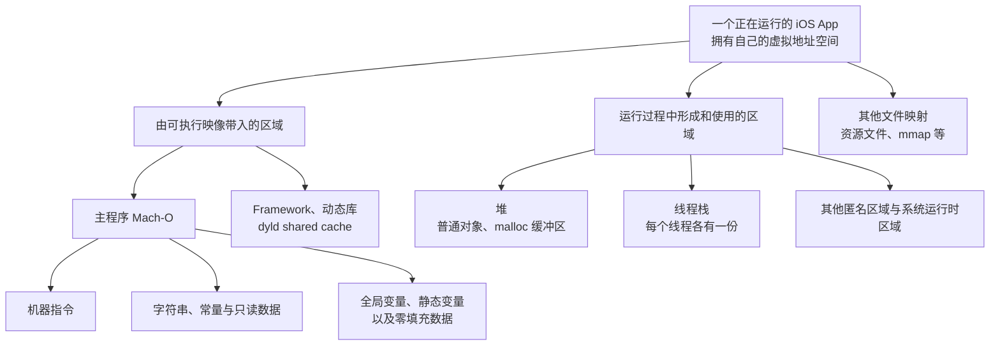
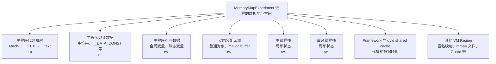

# iOS 内存地图：从虚拟地址空间到 VM Region

## 前言

在之前的文章中，笔者完成过两篇内存管理的入门文章：

- [【iOS】内存五大分区](https://www.tommywutong.cn/blog/csdn-import/csdn-154609757-ios-/)
- [【iOS】内存管理初级](https://www.tommywutong.cn/blog/csdn-import/csdn-152130856-ios-/)

受限于当时的知识面，这两篇文章对很多概念的理解较浅，部分表述也不够严谨。现在重新梳理 iOS 底层知识，希望从操作系统的虚拟内存出发，把"变量在哪里""对象在哪里""堆和栈是什么""Mach-O 的 Segment 又是什么"这些容易混在一起的问题逐层分开。

这篇文章只回答"一段虚拟地址属于哪里、由谁在什么时候放进去的"。这些地址背后的页面此刻是否真的占用物理内存、系统怎样统计和回收，放在系列下一篇 [[iOS 内存：Clean、Dirty、Compressed 与 Memory Footprint]] 里单独展开。

## 本文主线

全文按照下面的顺序展开：

```text
操作系统为什么需要虚拟内存
        ↓
一个 iOS App 获得怎样的虚拟地址空间
        ↓
用"五大分区"建立一张用途地图
        ↓
Mach-O、堆和线程栈分别怎样形成这些区域
        ↓
用 VM Region、内容来源和访问权限回到真实系统
        ↓
用代码和 LLDB 验证变量、指针与对象的位置
```

这里涉及两个不同的观察角度：

| 观察角度 | 主要回答的问题 | 典型概念 |
| --- | --- | --- |
| 用途 | 这段地址用来做什么 | 五大分区、代码、数据、堆、栈 |
| 来源 | 这段内容从哪里来、由谁在什么时候建立 | Mach-O、VM Region、`malloc`、线程栈 |

同一份数据可以同时被这两个角度描述。例如，一个全局变量在教学模型中属于全局/静态区（用途），在 Mach-O 中来自 `__DATA` 的某个 Section、运行时是一个具体的 VM Region（来源）。它们不是互相竞争的两种答案，而是从不同角度描述同一件事。至于这个 Region 现在是否真的占用物理内存、算 clean 还是 dirty，属于系列下一篇的"页面记账"视角，这里先不展开。

---

## 操作系统中的内存

在没有内存保护和地址转换机制的环境中，程序直接使用物理地址。多个程序如果使用了相同的地址，就可能互相覆盖数据。虽然系统也可以依靠人工规划固定的物理地址来运行多个程序，但这种方式难以做到可靠隔离、灵活装载和高效共享。

现代操作系统因此让进程主要使用虚拟地址，并由硬件和内核共同完成从虚拟地址到物理页的映射。不同进程中的同一个虚拟地址可以映射到不同的物理页；内核也可以通过权限控制，阻止进程访问不属于自己的映射。


- **虚拟内存（Virtual Memory）**：操作系统提供给进程的一层地址空间抽象。一个 iOS App 看到的是自己独立的虚拟地址空间，其中包含多个离散的虚拟内存区域（VM Region）。虚拟地址空间很大，但并不意味着其中每个地址都有效，也不意味着所有已映射页面都同时驻留在物理内存中。


- **物理内存（Physical Memory）**：设备真实存在、可由 CPU 访问的 RAM。进程访问虚拟地址时，CPU 的 MMU 会依据页表把它转换为对应的物理地址。

操作系统教材通常通过"分段"和"分页"两条路线介绍地址空间管理。对现代 arm64 iOS 来说，后文真正需要继续使用的是分页、页表、权限和 VM Region；分段主要帮助理解历史模型和逻辑区域。

### 分段


分段（Segmentation）是一种经典的内存管理思想：按照代码、数据、栈等逻辑单元描述地址空间，各段长度可以不同。它有助于理解"程序可以由不同用途、不同权限的区域组成"。

但这里必须区分三个名字相似、含义不同的概念：

- 操作系统教材中的 **Segmentation** 是一种地址转换和内存管理模型。
- Mach-O 中的 `__TEXT`、`__DATA` 等 **Segment** 是可执行文件及其装载映射的组织方式。
- 堆和栈是进程运行时使用的虚拟内存区域，不是"编译器创建的 CPU 分段"。

现代 arm64 iOS 的内存管理重点是分页和 Mach VM。后文讨论 Mach-O 时，还需要进一步观察 `__TEXT`、`__DATA` 等文件布局如何被映射为进程中的 VM Region。

### 分页


为了方便映射和管理，虚拟内存和物理内存都被分割成相同大小的单位，物理内存的最小单位被称为帧（Frame），而虚拟内存的最小单位被称为页（Page）。
Apple 当前文档指出，iOS 中典型的页大小是 16 KB；具体值仍应以设备和运行环境为准，可以通过 `vm_page_size`、`getpagesize()` 或 Jetsam Event Report 中的 `pageSize` 字段确认，而不应在程序逻辑中写死。

- **页表（Page Table）**：记录虚拟页到物理页的映射及读、写、执行等权限。代码访问虚拟地址时，CPU 内部的 **MMU（Memory Management Unit）** 会依据页表完成地址转换。
- **虚拟内存区域（VM Region）**：一段具有相同属性的连续虚拟地址范围。一个进程拥有许多 VM Region，但整个虚拟地址空间并非从头到尾连续有效。

内核建立和管理虚拟内存映射时以页为基本粒度，但这不意味着每次 `malloc` 几个字节都会单独浪费一个 16 KB 页面。用户态内存分配器会先取得并管理较大的虚拟内存区域，再把其中的小块空间分给不同对象；这就是后文讨论“堆”时需要建立的连接。


### 按需分页与 Page Fault（缺页中断）


1. **虚拟映射与延迟分配 (Lazy Allocation)**  
    当系统为进程分配内存，或通过 `mmap` 映射大文件（如动态库）时，仅仅是在进程的虚拟地址空间中划定了一块合法的 **VM Region**。**“建立虚拟地址映射”绝不等于“占用物理 RAM”**，此时物理内存的实际消耗为零。  
    
2. **触发调度 (Page Fault 机制)**  
    当 CPU 首次真正读写某个尚未驻留在物理内存的虚拟页时，现有的页表无法完成地址转换，从而触发**缺页中断 (Page Fault)**。这是一个正常的、连接虚拟与物理空间的桥梁，并非程序错误。  
    
3. **内核介入与数据流转 (Page In/Out)**  
    内核接管中断后，会根据该虚拟页的属性进行动态修复：  
    • **读取数据 (Page In)：** 如果是映射文件，内核会从磁盘（Backing Store）中将对应的数据精确加载到物理内存页中。  
    • **其他策略：** 内核也可能分配一个全零填充页 (Zero-Fill)，或者为只读共享页创建一个私有副本 (Copy-on-Write)。  
    • **数据换出 (Page Out)：** 由于虚拟空间远大于物理内存，macOS 等系统会将不常用的物理页写回磁盘以腾出空间（注：iOS 无此 Swap 机制，转而依靠内存压缩与 Jetsam）。  
    
4. **异常边界 (EXC_BAD_ACCESS 的本质)**  
    内核完成上述修复后，原指令会继续执行。**只有当 Page Fault 无法被内核修复时**（例如：访问了未映射的无效地址、或者是对只读的缺页尝试写入等权限冲突），系统才会判定为非法内存访问，并最终抛出 `EXC_BAD_ACCESS` 崩溃。因此，`EXC_BAD_ACCESS` 的底层实质，就是内核无能为力的致命缺页中断。

这里先把 Page Fault 当作一个连接点：它解释了为什么"已经分配或映射虚拟地址"仍不代表"对应物理页已经到位"。系列下一篇讨论 `malloc`、首次写入和 Memory Footprint 时还会再次用到这个结论。Apple 的 [About the Virtual Memory System](https://developer.apple.com/library/archive/documentation/Performance/Conceptual/ManagingMemory/Articles/AboutMemory.html) 对 soft fault、hard fault 和 page-in 有进一步说明。

关于分页、页表和地址转换的更多细节，可以继续阅读：[小林 Coding：为什么要有虚拟内存？](https://www.xiaolincoding.com/os/3_memory/vmem.html)。本文暂时停在能够支撑后续 iOS 地址空间分析的程度。


## 从操作系统过渡到 iOS App

一个运行中的 iOS App，本质上就是一个进程。系统会为它提供独立的虚拟地址空间。前文讨论的分页、页表和 VM Region，在这里不再只是操作系统教材中的抽象概念，而是 App 代码实际运行的环境。





我们首先来讲讲，一个iOS APP是怎样获得内存的 以便于后续的理解
### 阶段一：App还没有运行

这时候 App 的代码和数据存放在磁盘上的 Mach-O 文件中。
```
磁盘上的 Mach-O
├── __TEXT：代码、部分只读内容
├── __DATA_CONST：部分只读数据
├── __DATA：可写的全局、静态数据
└── 其他装载和链接信息
```

### 阶段二：用户启动App

系统创建一个进程，并给他一套独立的虚拟地址（非一整块连续的物理内存）空间。然后，内核和dyld根据 Mach-O 里的装载信息，把相关内容映射进虚拟地址空间。与此同时，依赖的系统 Framework、动态库和 dyld shared cache 也会被映射进来。

所以进程的完整虚拟地址空间，远大于主程序自己的 Mach-O。

### 阶段三：用 VM Region 描述这些映射

虚拟地址空间不是一个从头到尾全部有效的大数组，而是有许多离散的 VM Region组成。
一个 VM Region 可以先理解为：
> 一段连续的虚拟地址范围，这段范围具有相近的来源、用途和访问权限。

### 阶段四：App开始运行，堆和线程栈出现

Mach-O 主要解释启动时已经存在的代码和全局数据，但程序运行起来以后，还会不断产生新的内存需求。

- 每创建一个线程，系统都会为这个线程准备自己的栈 Region。
- 当程序执行malloc或创建普通Objective-C对象时，运行时需要动态分配内存 而这些通常来自堆，而堆也不是一整块固定区域，`malloc` 分配器会向系统获得并管理一个或多个 VM Region，再把其中的小块空间分给对象和缓冲区。


---


当物理内存中没有空闲页面时，操作系统必须先腾出一个已有页面的位置，才能装入新的页面。这个过程的具体实现因平台而异，体现了 OS X 与 iOS 在设计哲学上的根本分歧。

在 **OS X** 中，虚拟内存系统采用经典的**换页（paging）​**机制。后备存储（backing store）是一块基于磁盘的区域，保存着某个进程当前使用的内存页面副本。当系统需要腾出物理内存时，它会将暂时不用的页面**换出（page out / swap out）​**到后备存储；当程序再次访问这些数据时，系统再将其**换入（page in / swap in）​**回物理内存。这套机制让进程得以使用远超实际物理内存的地址空间，但代价是磁盘 I/O 延迟。

**iOS** 则完全放弃了后备存储，他实际上把页面分成了两类，处理方式不同：

**第一类：只读页面（ App 的代码、图片资源等）​**

这类数据的特点是内容永远不会变。所以 iOS 可以在内存紧张时直接把它们**从内存里丢掉**，反正磁盘上（App 安装包里）还有原始文件，下次需要时直接重新从磁盘读进来就行。这个动作看起来像"换页"，但本质不同——它不需要先写出去，因为数据从来没有被修改过，磁盘上的版本永远是最新的。

**第二类：可写页面（用户数据、运行时变量、堆内存等）​**

这类数据是程序运行过程中动态产生的，磁盘上根本没有副本。iOS **既不会把它们写到磁盘，也不会凭空变出空间**。所以当内存实在不够用时，系统唯一的选择就是：**把某个进程整个杀掉，回收它占用的所有内存。​**

这基于一下几点原因：
- 闪存物理特性限制，传统桌面系统的 swap 是为机械硬盘或 SSD 设计的，但移动设备使用的 NAND 闪存有**写入次数有上限**，如果 iOS 像 OS X 那样频繁地将内存页面换出到闪存，会大幅加速存储芯片的磨损，缩短设备整体寿命。
- **延迟问题。​** 即便是现代高速闪存，其访问延迟也远高于 DRAM。如果系统在响应用户手势的同时还在后台进行换页 I/O，UI 线程极易出现掉帧或冻结。iOS 从一开始就将**流畅性和响应速度**列为最高优先级，而 swap 机制天然与这个目标冲突。
- **架构层面的主动内存管理。​** 既然不能把压力转移给磁盘，iOS 就必须在内存层面做更精细的管理。这催生了一套完整的机制：系统会在内存紧张时向 App 发送 `didReceiveMemoryWarning` 通知，要求其主动释放缓存；如果 App 不配合，系统会按照优先级将其强制终止，这就是开发者熟悉的 **OOM（Out of Memory）Kill**。后台 App 会被挂起（suspended）而非持续运行，进一步减少内存占用。这套机制本质上是用"杀进程"代替"换页到磁盘"，是一种更激进但也更适合移动场景的取舍。
- **容量比例问题。​** 移动设备的 RAM 相对于存储容量的比例历来偏低（早期 iPhone 只有 256MB RAM），如果允许 swap，换页的开销会非常频繁，几乎无法实用。与其让系统陷入持续的磁盘抖动，不如直接终止不活跃的进程来得干净。


### 阶段五：CPU真正访问这些地址

无论一个地址属于代码、全局变量、堆还是栈，程序拿到的首先都是虚拟地址。CPU访问时经过页表查询到物理页，最终得到真实RAM中的数据


## “五大分区”

这就是我们经常提到的五大分区


- **代码区**：存放编译后的机器指令。在 iOS 中，主程序代码通常来自 Mach-O 的可执行映射。
- **常量区**：用于概括字符串字面量、部分只读常量等内容。真实情况下，它们可能分布在多个只读 Section 中，并不一定组成一个连续区域。
- **全局/静态区**：存放具有静态存储期的全局变量和静态变量。已初始化数据与零填充数据通常进入不同的 Mach-O Section。
- **堆区**：承接运行时动态分配的数据，例如普通 Objective-C 对象和 `malloc` 返回的缓冲区。ARC 管理 Objective-C 对象的所有权，但 `malloc` 取得的内存仍需要与 `free` 配对。
- **栈区**：每个线程都有自己的线程栈，用于支撑函数调用和临时状态。Debug、未优化时，部分局部变量可以在栈中观察到；优化后也可能进入寄存器。


“五大分区”是更多是一份用户分类，不包括进程中的所有真实映射。Framework、dyld shared cache、`mmap` 文件和 Guard Page 等内容，后文统一用 VM Region 解释。

```objc
#import <Foundation/Foundation.h>
#include <stdlib.h>

int globalNumber = 10;
static int staticNumber = 20;

void RunSimpleMemoryTest(void) {
    int localNumber = 30;
    NSString *text = @"Hello";
    NSObject *object = [[NSObject alloc] init];
    void *buffer = malloc(100);

    NSLog(@"global = %d", globalNumber);
    NSLog(@"static = %d", staticNumber);
    NSLog(@"local = %d", localNumber);
    NSLog(@"text = %@", text);
    NSLog(@"object = %@", object);
    NSLog(@"buffer = %p", buffer); // 在这里设置断点

    free(buffer);
}
```

可以在 `viewDidLoad` 中调用：

```objc
- (void)viewDidLoad {
    [super viewDidLoad];
    RunSimpleMemoryTest();
}
```

先用五大分区回答这段代码：

| 代码中的内容 | 教学模型中的位置 | 更准确的说明 |
| --- | --- | --- |
| `RunSimpleMemoryTest` 的机器指令 | 代码区 | 通常来自 Mach-O 的 `__TEXT,__text`，运行时映射通常可读、可执行 |
| `@"Hello"` 字符串字面量 | 常量区 | 字面量对象通常来自主程序的只读 Mach-O 映射 |
| `globalNumber`、`staticNumber` | 全局/静态区 | 二者具有静态存储期，本例均为已初始化的可写数据 |
| `localNumber` | 栈区 | Debug、`-O0` 下通常能在当前线程栈中观察到；优化后位置可能变化 |
| 局部变量 `text`、`object`、`buffer` 本身 | 栈区 | 它们是保存地址的局部指针变量；优化后也可能进入寄存器 |
| `[[NSObject alloc] init]` 创建的普通对象 | 堆区 | `object` 保存对象地址，对象本体通常来自动态分配区域 |
| `malloc(100)` 返回的缓冲区 | 堆区 | `buffer` 保存缓冲区地址，缓冲区由分配器管理，最后需要 `free` |

>五大分区是一种用途分类，但这些区域并不是在同一时刻、通过同一种方式产生的。代码、常量和全局/静态数据主要由 Mach-O 在 App 启动时带入虚拟地址空间；堆与线程栈则在 App 运行过程中由内存分配器和线程系统建立。下面分别分析这两条形成路径。


##  Mach-O
Mach-O是 iOS 可执行文件的组织格式，用来解释 App 启动前代码和全局数据保存在什么地方，以及启动后如何被映射进虚拟地址空间。

Mach-O 的 Segment 描述可执行文件及装载映射的组织方式；操作系统教材中的 Segmentation 描述的是一种地址管理模型。二者名字相似，但不能混为一谈。

### Segment 与 Section

Mach-O 使用两层结构组织内容：

- **Segment** 是装载和权限管理的大单位，例如 `__TEXT`、`__DATA_CONST`、`__DATA`。
- **Section** 位于 Segment 内部，用于继续区分具体内容，例如 `__text`、`__cstring`、`__data`、`__common`。

| Segment / Section | 实验中的内容 | 典型运行权限 |
| --- | --- | --- |
| `__TEXT,__text` | `RunSimpleMemoryTest` 的机器指令 | `r-x` |
| `__TEXT,__cstring` | C 字符串等字面量数据 | 随 `__TEXT` 映射；内容不可写，Region 可能因同一 Segment 包含代码而显示 `r-x` |
| `__DATA_CONST,__cfstring` | `@"Hello"` 等 Objective-C 字符串常量对象 | `r--` |
| `__DATA,__data` | `globalNumber`、`staticNumber` 等已初始化的可写数据 | `rw-` |
| `__DATA,__bss` / `__common` | 未初始化的全局、静态变量，装载时获得零填充空间 | `rw-` |

这里还有两个容易忽略的区域：

- `__PAGEZERO` 在 64 位 Mach-O 中保留低地址范围，不映射为可访问内存，有助于让空指针附近的访问尽早失败。
- `__LINKEDIT` 保存符号、字符串表、重定位等链接信息，服务于装载、符号解析和调试，但它不属于"五大分区"里的业务数据。

Mach-O 中记录的是链接时虚拟地址、大小和权限等装载信息。启动时，内核和 dyld 根据这些信息建立 VM Region，并继续映射依赖的 Framework 与 dyld shared cache。最终进程地址空间远大于主程序自己的 Mach-O。

### ASLR：为什么每次运行的地址可能不同

为了避免二进制每次都出现在固定地址，系统会在加载时引入随机的 **ASLR Slide**。可以先记住下面的关系：

```text
运行时地址 = Mach-O 中的链接地址 + ASLR Slide
```

同一份二进制连续启动两次时，`RunSimpleMemoryTest` 的绝对地址通常会发生变化。函数没有“搬到另一个 Section”，改变的是整份映像的加载基址。实验中不需要记忆任何固定十六进制地址，只需使用 `image lookup -n RunSimpleMemoryTest` 查看本次运行的结果。

比较地址时应该先判断它属于哪个映像，并结合 `image list`、`image lookup` 或 `vmmap` 获取加载地址，不能把不同运行中的绝对地址直接比较。

这个关系也是符号化（Symbolication）的核心。崩溃日志或 `image lookup --address` 拿到的都是运行时地址：工具先根据地址落在哪个镜像的加载范围内，确定它属于哪个镜像（崩溃报告的 "Binary Images" 段会记录每个镜像的加载基址），再用该镜像自己的 slide 把运行时地址减回链接地址，最后拿这个链接地址去 dSYM 里查函数名和行号。用错镜像的 slide，或者把不同镜像、不同进程、不同次运行的绝对地址直接比较，都会得到没有意义的结果——这也是为什么调试时要先用 `image list` 确认加载基址，而不是直接比较两次运行记下的十六进制数。Apple 在 WWDC21 [Symbolication: Beyond the basics](https://developer.apple.com/videos/play/wwdc2021/10211/) 中完整演示了 Linker Address、Load Address 与 ASLR Slide 的关系。

## 堆与线程栈：解释运行过程中出现的区域

Mach-O 主要解释启动时已经存在的代码和数据。App 开始运行后，动态申请的数据通常进入由内存分配器管理的堆区域；函数调用则会使用当前线程自己的栈。

- **堆**：不是一整块固定且永远连续的区域。`malloc` 等分配器会管理一个或多个虚拟内存区域，并把合适的空间交给调用方。
- **线程栈**：每个线程都有自己的栈，用来支撑函数调用和临时状态。多个线程共享进程的代码、全局数据和堆，但不共享同一个线程栈。
- **局部变量**：在未优化的直觉模型中经常位于栈帧；经过编译优化后，也可能只存在于寄存器中。

## 指针变量和对象本体分别在哪里

例如，在一个函数中声明 `NSObject *object = [[NSObject alloc] init];` 时：

- 局部指针变量 `object` 具有自动存储期，编译器通常会让它位于当前栈帧中，但经过优化后也可能只存在于寄存器中。
- `object` 保存的是对象地址；普通 Objective-C 对象通常由运行时在动态分配区域中创建。
- `&object` 表示指针变量本身的地址，`object` 表示其保存的对象地址，两者不是同一个概念。
- 并非所有看起来像对象的值都对应一次普通堆分配，例如字符串字面量和 Tagged Pointer。

可以把这一行代码拆成两个问题：

```text
&object  ── 指针变量自己的地址
object   ── 指针变量保存的值
              │
              └── 普通情况下指向对象本体
```

在基础实验中，`&object` 通常会和 `&localNumber` 落在同一个线程栈 Region；`object` 的值则通常落在分配器管理的可读写 Region。具体十六进制地址每次运行都可能变化，重要的是它们属于不同的地址范围。

这正好说明“指针变量在栈上”和“对象在堆上”可以同时成立。但这句话仍有三个边界：

1. **编译器优化**：局部变量可能只存在于寄存器中，或者被完全消除，因此“局部变量一定在栈上”不严谨。
2. **字符串字面量**：`@"Hello"` 通常落在主程序的只读映射内，并不是函数每执行一次就在堆上创建一个新字符串对象。
3. **Tagged Pointer**：部分小型 `NSNumber`、`NSDate`、`NSString` 等值可能直接编码在指针中，并不对应普通堆对象。它属于第二轮实验，本次基础代码暂不加入。

因此，面试中回答"对象在哪里"时，至少需要先确认讨论的是普通动态对象、字面量对象，还是 Tagged Pointer；回答"变量在哪里"时，还要区分变量本身和变量保存的值。

## 用 VM Region 回到真实 iOS

一个 VM Region 是指一段连续的内存页（在虚拟地址空间里），这些页拥有相同的属性（如读写权限、是否是 wired，也就是是否能被 page out）。举几个例子：

- mapped file，即映射到磁盘的一个文件
    
- __TEXT，r-x，多数为二进制
    
- __DATA，rw-，为可读写数据
    
- MALLOC_(SIZE)，顾名思义是 malloc 申请的内存
    

`task_basic_info`、`mach_task_basic_info` 描述的是整个任务（进程）的虚拟内存和驻留内存汇总信息，不是单个 VM Region。它们可以作为进阶补充，用来区分“进程级汇总指标”和“逐个 Region 的地址地图”：

```c
/* 旧结构的注释已明确建议改用 MACH_TASK_BASIC_INFO */
struct task_basic_info {
    integer_t       suspend_count;
    vm_size_t       virtual_size;
    vm_size_t       resident_size;
    time_value_t    user_time;
    time_value_t    system_time;
    policy_t        policy;
};

struct mach_task_basic_info {
    mach_vm_size_t  virtual_size;
    mach_vm_size_t  resident_size;
    mach_vm_size_t  resident_size_max;
    time_value_t    user_time;
    time_value_t    system_time;
    policy_t        policy;
    integer_t       suspend_count;
};
```

本篇主线继续观察具体地址落入哪个 VM Region；`virtual_size`、`resident_size` 与 Memory Footprint 的差别放到下一篇内存记账文章中再展开。

到这里已经知道：

- 代码、常量和部分全局数据由 Mach-O 带入进程；
- 堆在运行过程中承接动态分配；
- 每个线程拥有自己的栈；
- 指针变量和对象本体可能位于不同区域。

**五大分区按照用途分类，VM Region 则是内核描述一段连续虚拟地址范围的实际方式。** 一个 Region 具有起止地址、访问权限、内容来源等属性；同一教学分区可能由多个 Region 组成，一个 Mach-O Segment 在实际映射和保护过程中也不能简单等同于整张进程内存地图。

### 两种常见来源：文件映射与匿名内存

从"页面内容可以去哪里重新找"这一角度，VM Region 可以先粗分为两类：

- **文件映射（File-backed Mapping）**：内容来自 Mach-O、Framework、dyld shared cache 或通过 `mmap` 映射的文件。未被修改的页面可以丢弃，需要时再从原文件或系统缓存取得，因此通常更容易保持为 clean。
- **匿名内存（Anonymous Memory）**：没有一个可直接重新读取的原始文件，常见于堆、线程栈以及运行时申请的数据。程序真正写入后，相关页面通常成为 dirty；iOS 不能依赖传统磁盘 swap 为不断增长的匿名 dirty memory 兜底。

这不是说"文件映射永远 clean、匿名内存永远 dirty"。Mach-O 中的可写数据可能通过 Copy-on-Write 形成进程私有页面，文件映射也可能被修改；新申请的匿名地址也可能尚未真正触碰。这里的分类是为了回答内容来源，为系列下一篇的 Clean、Dirty 与 Memory Footprint 建立桥梁，具体的页面状态转换会在那一篇里展开。

### VM Region 的访问权限

调试工具经常用三个字母表示 Region 当前允许的操作：

| 权限 | 含义 | 常见例子 |
| --- | --- | --- |
| `r--` | 可读，不可写，不可执行 | 字符串对象和其他只读数据映射 |
| `rw-` | 可读、可写，不可执行 | 全局可写数据、堆、线程栈 |
| `r-x` | 可读、不可写、可执行 | Mach-O 中的机器指令 |
| `---` | 当前不可读写执行 | `__PAGEZERO`、Stack Guard 等保护区域 |

权限让同一进程中的区域承担不同职责，也贯彻了"数据不可随意执行、代码不可随意写入"的安全边界。Apple 在 [Investigating memory access crashes](https://developer.apple.com/documentation/xcode/investigating-memory-access-crashes) 中展示了 `r-x` 的 `__TEXT`、`rw-` 的线程栈以及无权限的 Stack Guard。

把五大分区、来源和权限放到一起，可以得到更接近真实系统的关系：

| 教学用途 | 常见形成方式 | 常见权限 | 后续页面状态线索 |
| --- | --- | --- | --- |
| 代码 | Mach-O / Framework 文件映射 | `r-x` | 未修改时通常可从文件重新取得 |
| 常量 | Mach-O 只读数据映射 | `r--`，或随 `__TEXT` 显示为 `r-x` | 通常更容易保持 clean |
| 全局/静态数据 | Mach-O 数据映射、零填充页、Copy-on-Write | `rw-` | 被写入后可能贡献 dirty memory |
| 堆 | 分配器管理的匿名内存 | `rw-` | 实际写入的页面通常贡献 dirty memory |
| 线程栈 | 每个线程各自的匿名 Region | `rw-`，边界附近可有 `---` Guard | 被使用的栈页面属于进程需要负责的内存 |

这一步完成了本文最重要的转换：

```text
五大分区告诉我们"用来做什么"
        ↓
Mach-O、堆和线程栈告诉我们"怎样形成"
        ↓
VM Region 告诉我们"系统怎样描述"
        ↓
文件/匿名来源和页面状态继续解释"系统怎样回收与记账"（见系列下一篇）
```

## 用 LLDB 验证基础实验

本次记录的实验环境为：

| 项目    | 环境                                                        |
| ----- | --------------------------------------------------------- |
| Xcode | 26.6                                                      |
| 运行环境  | iPhone 16 Pro Simulator，iOS 18.4，Apple Silicon Mac        |
| 构建方式  | Objective-C、Debug 信息、`-O0`                                |
| 页面大小  | `vm_page_size = 16384`，即 16 KB                            |
| 验证方式  | 在 `RunSimpleMemoryTest` 内设置断点，通过 LLDB 比较变量地址并查询 VM Region |

Simulator 与真机不完全相同，尤其是系统共享缓存、分配器实现、地址编码和内存压力行为。下面的基础步骤用于学习怎样观察地址；本节后半部分再用 iPhone 15 的两轮真机数据验证结论。无论哪种环境，都不能由一次运行推导所有 iPhone 的固定地址。

在 `NSLog(@"buffer = %p", buffer);` 这一行设置断点。程序停下后，先执行第一组命令，只比较“变量本身的地址”和“变量保存的地址”：

```lldb
p/x &globalNumber
p/x &staticNumber
p/x &localNumber
p/x &text
p/x text
p/x &object
p/x object
p/x &buffer
p/x buffer
```

这里应该先观察到三组关系：

1. `&globalNumber` 与 `&staticNumber` 通常落在主程序的可写数据映射中；
2. `&localNumber`、`&text`、`&object`、`&buffer` 在 Debug、`-O0` 下通常落在当前线程的栈 Region；
3. `text`、`object`、`buffer` 保存的地址与这些局部指针变量自己的地址不同。

第一组理解之后，再检查这些地址分别属于哪个映像和 VM Region：

```lldb
image lookup -n RunSimpleMemoryTest
image list
```

`image lookup` 用来确认函数属于主程序的 `__TEXT,__text`。对于其他变量，先复制 `p/x` 得到的实际地址，再执行：

```lldb
memory region 0x实际地址
```

例如，假设本次 `object` 打印为 `0x600000012340`，就执行：

```lldb
memory region 0x600000012340
```

这里的地址只是命令格式示例，不是固定结果。ASLR、分配器和每次运行状态都会改变绝对地址。

基础实验应当得到下面这些“关系结果”：

| 观察对象 | 预期的 Region 特征 | 能说明什么 |
| --- | --- | --- |
| `RunSimpleMemoryTest` | 主程序映像中的 `r-x` 区域 | 函数机器指令属于代码映射 |
| `text` 指向的 `@"Hello"` | 主程序的只读映射，具体权限以当次构建为准 | 字符串字面量不是每次调用都新建的普通堆对象 |
| `globalNumber`、`staticNumber` | 主程序映像中的 `rw-` 区域 | 已初始化的全局、静态变量来自可写数据映射 |
| `&localNumber` | 当前线程的 `rw-` 栈 Region | 局部整数在本次 Debug 实验中位于线程栈 |
| `&text`、`&object`、`&buffer` | 通常与 `&localNumber` 位于同一个栈 Region | 局部指针变量本身也属于当前函数的临时状态 |
| `object` | 分配器管理的可读写 Region | 普通 Objective-C 对象本体通常在堆中 |
| `buffer` | 分配器管理的可读写 Region | `malloc` 返回的是动态缓冲区地址 |

不要比较表中的“地址大小关系”，而要比较它们属于哪个映像、哪个 Region、具有怎样的权限。再次运行时绝对地址变化是正常现象。

### iPhone 15 真机实测

为了确认 Simulator 上的结论能否在真实 iOS 环境中复现，我另外建立了一个最小 Objective-C 实验 App `MemoryMapLab`。真机环境如下：

| 项目 | 环境 |
| --- | --- |
| 设备 | iPhone 15（iPhone15,4，arm64e） |
| 系统 | iOS 26.5 |
| Xcode | 26.6 |
| 构建方式 | Objective-C、Debug、`-O0`，实验函数使用 `noinline` 与 `optnone` 保持可观察性 |
| 页面大小 | `sysconf(_SC_PAGESIZE) = 16384`，即 16 KB |
| Region 数据来源 | App 对自身地址调用 `vm_region_64`，同时输出地址、Region 范围和当前权限 |

第一轮启动取得的代表性结果如下：

| 观察对象 | 运行时地址 | 所在 Region 与权限 | 说明 |
| --- | --- | --- | --- |
| `RunMemoryExperiment` | `0x102eb4e14` | `0x102eb0000–0x102eb8000 r-x` | 函数机器指令位于主程序的可执行映射 |
| `globalInitialized` | `0x102ebc958` | `0x102ebc000–0x102ec0000 rw-` | 已初始化全局变量位于可写数据映射 |
| `staticInitialized` | `0x102ebc95c` | `0x102ebc000–0x102ec0000 rw-` | `static` 改变链接可见性，不会因此形成一个独立“静态区” |
| `globalZeroInitialized` | `0x102ebc960` | `0x102ebc000–0x102ec0000 rw-` | 零初始化变量运行时同样需要可写存储 |
| `&globalStringLiteral` | `0x102eb80d8` | `0x102eb8000–0x102ebc000 r--` | 这是全局常量指针变量自己的地址 |
| `globalStringLiteral` 指向的字面量对象 | `0x102eb8120` | `0x102eb8000–0x102ebc000 r--` | 字符串字面量本体位于只读映射 |
| `&localNumber` | `0x16cf4c96c` | `0x16ce54000–0x16cf50000 rw-` | 本次 Debug 构建中局部整数位于主线程栈 |
| `&object` | `0x16cf4c960` | `0x16ce54000–0x16cf50000 rw-` | 局部指针变量本身与其他局部状态位于线程栈 |
| `object` 指向的 `NSObject` | `0x107d98ba0` | `0x107c00000–0x108000000 rw-` | 对象本体位于分配器管理的可写 Region |
| `malloc` 返回的缓冲区 | `0x107eb0000` | `0x107c00000–0x108000000 rw-` | 堆并非一个独立、连续且边界固定的“大盒子” |
| `@(runtimeValue)` | `0x9af4dd61519470e0` | 无普通 VM Region | 本次运行生成了 Tagged Pointer，没有单独的普通堆对象地址 |

这里最重要的不是记住这些十六进制数，而是观察地址之间的关系：

1. 函数、只读字面量、可写全局数据分别落入 `r-x`、`r--`、`rw-` 的映像 Region；
2. 局部指针变量和它指向的对象本体是两个地址，前者本次位于栈，后者位于分配器管理的区域；
3. 普通对象与 `malloc` 缓冲区虽然都可归入教学模型中的“堆”，系统看到的却是分配器管理的 VM Region；
4. Tagged Pointer 的值不是一个可以交给 `memory region` 查询的普通对象地址。其具体编码属于运行时实现细节，不能依赖本次位模式。

为了验证 ASLR，完全退出并第二次启动同一份二进制，得到以下代表性变化：

| 观察对象 | 第一轮 | 第二轮 |
| --- | --- | --- |
| `RunMemoryExperiment` | `0x102eb4e14` | `0x1041a0e14` |
| `globalInitialized` | `0x102ebc958` | `0x1041a8958` |
| 字符串字面量对象 | `0x102eb8120` | `0x1041a4120` |
| `&localNumber` | `0x16cf4c96c` | `0x16bc6096c` |
| `NSObject` 对象本体 | `0x107d98ba0` | `0x1091acad0` |

主程序中的函数、全局数据和字面量跟随同一个 Mach-O 映像整体移动，权限和相对布局保持一致；栈和堆地址则由线程栈、分配器和当次运行状态分别决定，不能拿它们与 Mach-O 的 slide 做同一种推导。这正是“ASLR 改变装载基址，但不会把代码突然变成堆内存”的真机证据。

需要明确数据来源：上表的地址与 Region 是实验 App 通过 `vm_region_64` 对自身查询后记录的，不是伪装成 LLDB transcript 的输出。要在 Xcode 中独立复核，可以给 `MemoryExperimentBreakpoint` 添加符号断点；停下后先用 `up` 回到 `RunMemoryExperiment`，再执行：

```lldb
frame variable localNumber object localLiteral runtimeValue taggedNumber heapBuffer
p/x &globalInitialized
p/x &globalZeroInitialized
p/x &staticInitialized
p/x globalStringLiteral
memory region &globalInitialized
memory region heapBuffer
```

### 从单个地址扩展

LLDB 适合追踪"这个地址是什么"，`vmmap` 更适合回答"整个进程有哪些 Region"。对运行中的调试进程或导出的 Memgraph，可以从下面的命令开始：

```shell
vmmap -summary 12345
vmmap /path/to/App.memgraph
```

Xcode 与 Instruments 中几个常见工具关注的问题并不相同：

| 工具 | 主要回答的问题 |
| --- | --- |
| LLDB | 某个变量、对象或地址当前是什么 |
| `vmmap` / VM Tracker | 进程有哪些 VM Region，各区域多大、权限和 dirty/compressed 情况如何 |
| Xcode Memory Report | App 当前的 Memory Footprint 和趋势如何 |
| Debug Memory Graph | 哪些对象彼此持有，是否存在引用环 |
| Allocations / Leaks | 堆对象何时分配，是否存在无法回收的泄漏 |

结合本次实验，可以先画出一张不强调高低地址顺序的内存地图：




---

## 总结

到这里可以得出六个结论：

1. 进程使用的是由多个 VM Region 组成的虚拟地址空间，虚拟地址并不等于物理地址。
2. 合法地址对应的页面尚未驻留也可能触发 Page Fault；内核能够修复的 Page Fault 是按需分页的正常过程，不等于崩溃。
3. 文件映射和匿名内存说明页面内容从哪里来，`r--`、`rw-`、`r-x` 等权限说明程序能对该 Region 做什么。
4. "五大分区"是一张用途地图，适合建立直觉，但不是 Darwin/iOS 对所有 VM Region 的完整分类，也遗漏了 Framework、dyld shared cache、`mmap` 文件、Guard Page 等真实存在的 Region。
5. Mach-O 解释启动时的代码和数据如何进入地址空间；堆和线程栈则解释运行过程中出现的动态区域；ASLR 会改变映像每次运行的加载地址，符号化的本质就是把这个偏移减回去。
6. 回答"变量和对象在哪里"时，必须分别讨论变量本身、变量保存的地址、对象本体以及字面量或 Tagged Pointer 等例外。

这六条结论回答的都是"在哪里"和"从哪里来"。但虚拟地址范围、堆分配量、驻留物理页和 Memory Footprint 是不同的指标——一段地址被"分配"，不代表它现在真的占用物理内存。这句话正好是系列下一篇的起点：[[iOS 内存：Clean、Dirty、Compressed 与 Memory Footprint]] 会继续讨论 Clean、Dirty、Compressed 与内存压力下的回收策略。

## 参考资料

### 官方资料

- [Apple — About the Virtual Memory System](https://developer.apple.com/library/archive/documentation/Performance/Conceptual/ManagingMemory/Articles/AboutMemory.html)
- [Apple — Overview of the Mach-O Executable Format](https://developer.apple.com/library/archive/documentation/Performance/Conceptual/CodeFootprint/Articles/MachOOverview.html)
- [Apple — Viewing Virtual Memory Usage](https://developer.apple.com/library/archive/documentation/Performance/Conceptual/ManagingMemory/Articles/VMPages.html)
- [Apple — Investigating memory access crashes](https://developer.apple.com/documentation/xcode/investigating-memory-access-crashes)
- [Apple — Reducing your app's launch time](https://developer.apple.com/documentation/xcode/reducing-your-app-s-launch-time)
- [WWDC21 — Symbolication: Beyond the basics](https://developer.apple.com/videos/play/wwdc2021/10211/)
- [Apple Kernel Programming Guide — Memory and Virtual Memory](https://developer.apple.com/library/archive/documentation/Darwin/Conceptual/KernelProgramming/vm/vm.html)
- [LLDB — GDB to LLDB command map](https://lldb.llvm.org/use/map.html)
- [LLDB — Symbolication](https://lldb.llvm.org/use/symbolication.html)

### 操作系统资料

- [小林 Coding — 图解操作系统](https://www.xiaolincoding.com/os/)
- [小林 Coding — 为什么要有虚拟内存？](https://www.xiaolincoding.com/os/3_memory/vmem.html)
- [小林 Coding — malloc 是如何分配内存的？](https://www.xiaolincoding.com/os/3_memory/malloc.html)

### iOS 与 Objective-C 延伸

- [Size Matters: An Exploration of Virtual Memory on iOS](https://alwaysprocessing.blog/2022/02/20/size-matters)
- [Mike Ash — Stack and Heap Objects in Objective-C](https://www.mikeash.com/pyblog/friday-qa-2010-01-15-stack-and-heap-objects-in-objective-c.html)
- [Mike Ash — Intro to the Objective-C Runtime](https://www.mikeash.com/pyblog/friday-qa-2009-03-13-intro-to-the-objective-c-runtime.html)
- https://juejin.cn/post/6844903902169710600?searchId=202607242005413F8E66D396B122E9CEF3
- 本地：[[20 专题笔记/编译链接与启动/Mach-O|Mach-O]]
