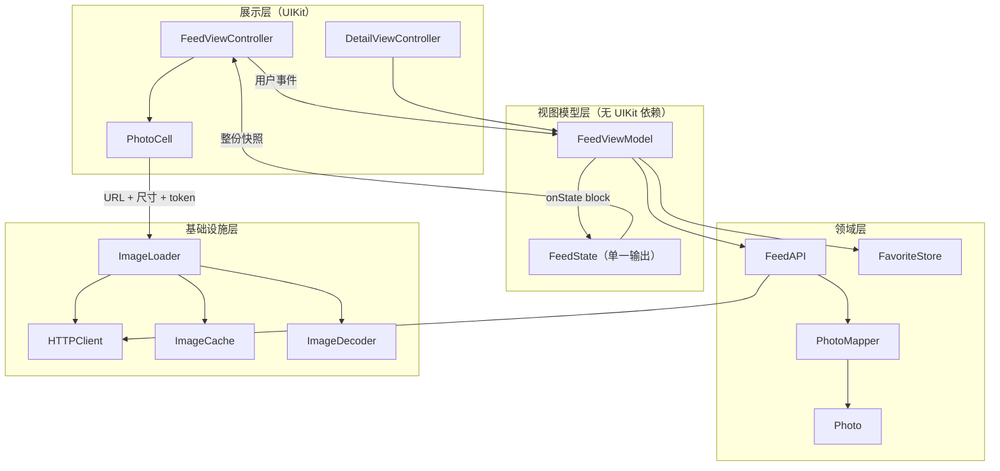
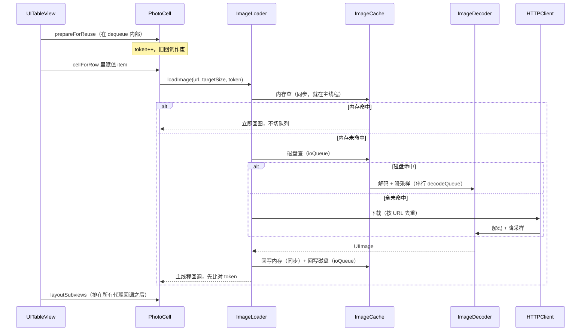

# 综合项目设计文档：把这个系列用一遍

前面三十七篇每一篇都在拆一个零件。这一篇把零件装回去。

装的过程里有件事我没预料到。决定这个 App 快不快的，几乎没有一条是"用了什么框架"。是一堆看起来无关紧要的开关：`estimatedRowHeight` 写不写 0，`NSCache` 的 `cost` 传不传真值，`heightForRowAtIndexPath:` 里有没有一次 `boundingRectWithSize:`。最后这条在 [[iOS UITableView：复用池的真实结构与代理调用顺序]] 里量到的是一万行首屏 3805.78 毫秒对 9.40 毫秒。同一份代码，同一台机器，差三个数量级。

所以这份文档的写法是：每个决策后面挂一个数字，数字后面挂一条双链，指向那个数字是在哪一篇里跑出来的。没测过的地方我明写"没测过"。

不建 Xcode 工程，这是 2026-07-26 定下的边界。我认为定得对。工程一周能写完，把每条决策的依据找齐花了三十七篇。

---

## 一、这个 App 是什么，为什么是它

**图片流 + 详情 + 本地收藏。** 三个页面，一个数据源。

选它的理由不是"经典"。是它恰好把这个系列里可测量的东西全部串上，而且没有一处是硬凑的：

| 这个 App 必须做的事 | 系列里对应的篇 |
| --- | --- |
| 拉一页 JSON，处理超时、取消、重试 | [[iOS 网络分层：URLSession 之上该有几层]] |
| JSON 变成模型对象 | [[iOS YYModel 源码：为什么比 JSONModel 快]]、[[iOS JSONModel 源码：Runtime 驱动的属性映射]]、[[iOS 序列化：NSCoding、NSSecureCoding 与 JSON 三条路]] |
| 一屏十几张图，下载、解码、两级缓存 | [[iOS SDWebImage：下载、解码与两级缓存的完整链路]] |
| 列表复用，高度策略，滚动不掉帧 | [[iOS UITableView：复用池的真实结构与代理调用顺序]]、[[iOS UIView 与 CALayer：三棵树、绘制流水线与离屏渲染]] |
| 收藏落盘，重启还在 | [[iOS 持久化选型：沙盒、plist、NSUserDefaults 与 Keychain]] |
| 后台队列和主线程之间来回交接 | [[iOS GCD：队列不是线程，以及死锁的准确边界]]、[[iOS NSOperation：状态机、依赖与自定义并发 Operation]]、[[iOS 锁：从 OSSpinLock 的废弃说起]] |
| 三个页面之间同步状态 | [[iOS 对象通信：delegate、通知、target-action 与 block 回调]]、[[iOS 架构模式：MVC 到 MVVM，以及它们各自解决不了的问题]] |
| cell 上的异步回调不能串图 | [[iOS Block 循环引用与 weak-strong dance]]、[[iOS weak 的实现：SideTable 与置 nil 的时机]] |

母计划第八阶段 Day 10 给的最小需求是 `URLSession 拉 JSON → 模型 → SDWebImage 展示 → 缓存一项数据 → UITableView`，并且写明"持久化只从 Day 1 的四种方案中选一种，不在总项目里再引入新框架"。这条约束我照办，而且往前推了一步：整个项目只引一个第三方库。理由在第五节。

范围之外的东西我先划掉，免得后面反复纠结：不做登录，不做上传，不做搜索，不做分页以外的任何列表交互，不做 Core Data。

---

## 二、模块划分与数据流

四层，自下而上。层与层之间只允许向下依赖。

三条边界的划法值得单说。

`ImageLoader` 不归 `FeedViewModel` 管。 cell 直接找它要图。理由是两边的节奏完全不同步。[[iOS UITableView：复用池的真实结构与代理调用顺序]] 里那组实验，200 行滚 6 步累计发出 40 个在途请求，同期只新建了 16 个 cell 实例，靠 token 挡掉 24 个过期回调。这套作废逻辑必须贴着 cell 的生命周期走，中间隔一层 ViewModel 只会让 token 对不上。

`PhotoMapper` 独立成类，不塞进 `FeedAPI`。 这是全工程唯一一块能完全脱离 UIKit 单测的逻辑。[[iOS 架构模式：MVC 到 MVVM，以及它们各自解决不了的问题]] 那篇量过一组对照：MVC 版本可脱离 UIKit 单测的行数是 0，MVVM 版是 143 行、占 62%。0 这个数字是硬碰硬的，编译直接报 `fatal error: 'UIKit/UIKit.h' file not found`。第一天先写这一层，就是冲着它能测去的。

`FeedViewModel` 只有一个输出，一个 `FeedState` 结构，而不是四个各自独立的 `Observable`。原因在第五节争议二。

### 一次滚动的完整数据流

内存命中那一支是同步的，就在调用线程上返回。这不是偷懒，是设计。[[iOS SDWebImage：下载、解码与两级缓存的完整链路]] 里量到内存命中耗时 0.03 毫秒且回调线程仍是主线程，那篇的原话是"内存命中这一支是同步的，而且这正是它能撑住列表滚动的原因"。如果为了"统一异步"给内存命中也套一次 `dispatch_async`，滚动时每个 cell 都要等下一次 RunLoop callout 才有图，肉眼可见地闪。

---

## 三、类职责表

"不做什么"那一栏比"做什么"那一栏难写。它是把踩过的坑翻译成边界。

| 类 | 做什么 | 不做什么 |
| --- | --- | --- |
| `HTTPClient` | 持有两个 `NSURLSession`（常规 + background）；发 `NSURLRequest`；把 `(NSData, NSHTTPURLResponse, NSError)` 三个各自可空的东西归一成一个非此即彼的结果 | 不认识业务模型；不重试；不解析 JSON；不判断 401 该弹什么 |
| `APIRequest` | 一个值对象：path、method、query、body、超时档位 | 不持有 session；不可变，建好就不改 |
| `FeedAPI` | 把"第几页"翻译成 `APIRequest`；调用 `HTTPClient`；调用 `PhotoMapper`；管重试与退避；对外暴露一个覆盖全部尝试的取消句柄 | 不碰 `UIImage`；不缓存模型；不把 HTTP 状态码往上传（401 除外） |
| `PhotoMapper` | 字典 → `Photo`；字段缺失和类型错误的兜底；返回带 keyPath 的错误 | 不发网络；不引 UIKit；不做缓存 |
| `Photo` | 不可变模型：id、图片 URL、原始宽高、标题、作者 | 不知道自己被收藏了没有；没有任何格式化方法；不带 `NSCoding` |
| `ImageLoader` | 按 URL 去重；发起下载；调度解码；查写两级缓存；发放和作废 token | 不知道 cell 是什么；不决定图片显示成什么尺寸（尺寸由调用方传） |
| `ImageDecoder` | 在串行队列上解码 + 降采样到目标像素尺寸 | 不碰缓存；不回主线程；不并发 |
| `ImageCache` | 内存 `NSCache` + 磁盘目录；cost 计算；磁盘容量与过期清理 | 不解码；不下载；不保证驱逐顺序（见第四节 D8） |
| `ImageRequestToken` | 一个整数加一个 `__weak` 宿主。判断"这个回调还该不该生效" | 不持有请求；不能取消下载（取消由 `ImageLoader` 做） |
| `FavoriteStore` | 收藏集合的增删查；落盘；启动时读回 | 不发通知给 UI（由 ViewModel 转发）；不存图片；不存整个 `Photo` |
| `FeedViewModel` | 分页加载；把 `Photo` 格式化成 cell 直接能用的 DTO；合成唯一的 `FeedState`；收藏动作转发 | 不引 UIKit（不造 `UIColor`、不算 `NSAttributedString`）；不做导航；不持有 cell |
| `FeedState` | 一个不可变快照：`items`（数组）、`loading`、`error`、`empty` 四者互斥 | 没有方法；不发通知；不可变 |
| `FeedViewController` | 建视图；`UITableViewDataSource` / `Delegate`；把 state 渲染到界面；push 详情页 | 不发网络；不格式化任何字符串；不读 `FavoriteStore` |
| `PhotoCell` | 布局；把 DTO 贴到子视图；向 `ImageLoader` 要图；`prepareForReuse` 里作废 token | 不读数据源；不重建子视图；不持有 `indexPath` |
| `DetailViewController` | 详情页。走朴素 MVC，无 ViewModel | 不复用 `FeedViewModel` 的 state |

`Photo` 那行的"不知道自己被收藏了没有"是有代价的判断。把 `isFavorite` 塞进模型会省掉一次查询，但它会让同一个 `Photo` 在列表页和详情页出现两份状态不一致的副本。收藏态的真相只有一份，在 `FavoriteStore` 里，`FeedViewModel` 在合成 DTO 的时候去问一次。

`PhotoCell` 那行的"不读数据源"来自 [[iOS UITableView：复用池的真实结构与代理调用顺序]] 的一条时序事实：`prepareForReuse` 是在 `dequeue` 内部触发的，早于 `heightForRow`，也早于你在 `cellForRow` 里赋值。那一刻 cell 没有 `indexPath`，`cell.superview` 可能已经是 nil。在那里读数据源等于在猜自己接下来会被派给谁。

---

## 四、六十条决策，每条回指一篇

这是本文的主体。格式统一：决策 → 依据 → 出处。

### A. 网络

A1｜不建独立请求层，只有一个 `HTTPClient` 加一个 `FeedAPI`。
[[iOS 网络分层：URLSession 之上该有几层]] 给的阈值是 20 个接口。这个 App 有两个接口。那篇的原话是"这个规模下多加一层的收益是负的，你会花更多时间在往上传参数上"。

A2｜判断成功失败时先看 error 再看 status，顺序不能反。
同篇的错误分档实测：404 / 500 / 503 的 `error` 全是 nil，手动 cancel 的 `status` 是 200 而 `error.code` 是 -999。任何 `if (error) { 失败 } else { 成功 }` 的写法在 500 上会走成功分支。`HTTPClient` 归一结果类型的全部意义就在这里。

A3｜`timeoutIntervalForRequest` 设 15 秒，`timeoutIntervalForResource` 按接口分档：普通 API 30 秒，图片下载 60 秒。
默认值是 60 和 604800（七天），后者等于没设。更要命的是语义：`timeoutIntervalForRequest` 是"多久没有新数据"的空闲计时器，不是这次请求的总时长上限。同篇 B 组实测，服务端持续吐数据 12 秒、`reqTO=3`，最终耗时 12.6 秒且返回 200。设了 3 秒超时的接口可以卡住任意长的时间，只要对端隔一会儿吐一个字节。resource 超时的精度是"稳定地晚 0.5 到 0.9 秒"，做用户可见的超时提示时要把这个偏差算进去。

A4｜业务缓存不用 `URLCache`，图片和 JSON 都自己管。
理由只有一条，但足够：缓存 key 不含 `Authorization`。同一个 URL、不同的认证头共用同一个缓存条目。这个 App 现在没有登录，但"以后加登录"是必然发生的事，而这条路径的事故形态是用户 B 拿到用户 A 的 body 且请求根本没出去。`URLCache` 留给不带认证的静态资源。另外三条一起记住：404 会被缓存，`ephemeral` 不写磁盘但仍走内存缓存，304 你在 `completionHandler` 里永远看不到。

A5｜重试和取消绑在同一层，取消句柄必须覆盖所有尝试加所有退避窗口。
[[iOS 网络分层：URLSession 之上该有几层]] 里跑出过一个真 bug：用户在第一次失败后 0.15 秒取消，退避窗口是 0.30 秒，结果服务端仍收到了 2 次请求。那篇给的定律我直接抄进设计：只要重试和取消不在同一层，中间那段退避窗口就一定是个漏洞。参数照它的：白名单 408/429/500/502/503/504，退避 0.30 秒起，抖动最多 0.1 秒，最多 4 次，非幂等方法只在服务端给了 `Retry-After` 时才重试。

A6｜取消之后一定有回调，不需要为"回调没来"准备兜底。
同篇的边界实测：刚 `dataTaskWithURL:` 出来还没 resume 就 cancel，completion 照样以 -999 调用一次；二次 cancel 不崩。需要准备的是"回调来了但携带的是 -999"，而且 `data` 参数是 nil，尽管 `countOfBytesReceived` 明确说已收到 64 字节。图片下载想保留已下载部分只能走 delegate 版。

### B. 模型映射

B1｜用 YYModel，不用 JSONModel。
性能不是理由。[[iOS JSONModel 源码：Runtime 驱动的属性映射]] 实测 JSONModel 单个对象 25.2 微秒，一屏 20 条是 0.5 毫秒，一帧预算 16.7 毫秒，量不出来。真正的理由是错误行为：标量属性收到 JSON 数组或对象会抛 `NSException` 且绕过 `error:` 参数，后端把一个 `count` 字段从数字改成对象，App 就整片挂掉。而 ObjC 泛型在 `property_getAttributes` 里被完全擦掉，`NSArray<Kid *> *` 拿到的编码是 `T@"NSArray<Optional>"`，`Kid *` 一字不剩，`NSProtocolFromString(@"Kid")` 返回 NULL。只写泛型不写协议，数组里躺着原始字典，而 `error` 是 nil。

B2｜所有 `int` / `int32_t` 属性一律改成 `NSInteger` 或 `long long`。
[[iOS YYModel 源码：为什么比 JSONModel 快]] 抓到的 fall-through bug 从 2015 年留到现在：`YYEncodingTypeInt32` 分支后面没有 `break`，每个 `int` 属性的 setter 被调两次，第二次的值覆盖第一次。实测 `json -2.7 -> int i=0 (setter called 2)`，而同一份数据给 `long long` 是正确的 -2。这条在 `Photo` 上直接命中：`width` 和 `height` 是整数。

B3｜长整型 ID 用字符串传，日期字段自己写转换。
ID 那条来自 [[iOS 序列化：NSCoding、NSSecureCoding 与 JSON 三条路]]：Foundation 的数字精度是三级阶梯，≤19 位走 `SInt64` 精确、20~39 位走 `NSDecimalNumber` 精确、≥40 位尾部补零。流传的 2^53 阈值是 JavaScript 的，从 Web 抄到 iOS 会抄错。日期那条来自 YYModel 篇：它的日期白名单是硬编码的十种格式，六位微秒不认，Unix 时间戳完全不支持。

B4｜启动后的空闲时机把主要 model 各 `init` 一次。
YYModel 建元数据表首次 0.16 毫秒、稳态 3.4 微秒，差 49 倍。几十个 model 类就是十几毫秒的一次性成本。这笔钱要么在首屏付，要么在启动后的空闲帧付。JSONModel 那边这个比例更夸张，冷热差 124 倍。

B5｜`PhotoMapper` 的失败必须有 keyPath。
两个库的静默失败清单都很长：YYModel 的 `int <- "abc"` 得 0、`int <- NSNull` 也得 0；JSONModel 的 `"abc"` 转数字得 0，model 数组里的非字典元素被直接丢掉且 `error` 是 nil。想区分"服务端明确给了 false"和"服务端给了垃圾"，属性必须声明成 `NSNumber *`。所以 `Photo` 里可能缺失的字段全部用对象类型，`PhotoMapper` 在映射之后自己再校验一遍。

### C. 图片

C1｜解码放在一条串行队列上，绝不并发。
[[iOS SDWebImage：下载、解码与两级缓存的完整链路]] 的 `coderQueue` 就是 `maxConcurrentOperationCount = 1`，理由是跑的是纯 CPU 位图填充，开多路只会互相抢核。

C2｜强制解码这个决定，省的不是 CPU 时间。
同篇实测：懒加载的图第一次绘制 99 到 308 毫秒，预解码过的稳定在 8.8 到 10.1 毫秒，差 12 到 30 倍；而预解码本身要花 110.5 毫秒。总量基本持平。**强制解码没有省掉任何工作，它只是把这一百毫秒从主线程挪到了后台队列。** 这一点几乎没有中文文章写清楚过，很多人把它当成一个"性能优化"来做，然后困惑于为什么 Time Profiler 上总时间没变。

C3｜真正省下量级的是降采样，不是解码时机。
4032×3024 的 JPEG，磁盘 1.04 MB。不带 context 直接解出来 `sd_memoryCost` 是 46.510 MB；带 400×400 缩略图参数解出来是 0.458 MB，101 倍。物理内存那组更直观：6 张全尺寸 285.74 MB，6 张缩略图 7.28 MB。列表页一律走 `kCGImageSourceThumbnailMaxPixelSize` 指定像素尺寸，不用 `limitBytes`（后者只保证不超上限、尺寸取决于原图）。

C4｜目标像素尺寸在 `viewDidLayoutSubviews` 之后才算得出来。
[[iOS UIViewController：生命周期的真实顺序与容器控制器]] 的几何有效性对照：`viewWillAppear:` 时 `window` 是 `0x0`、`safeAreaTop` 是 0.0；`viewIsAppearing:` 时 window 有值、`safeAreaTop = 95.0`，但子视图 frame 仍是 `{{0,0},{0,0}}`；只有 `viewDidLayoutSubviews` 里 `box.frame` 才是 `{{0,95},{390,44}}`。这一层假得很安静，不报错，只是给你 0 和 nil。

C5｜`NSCache` 的 `cost` 必须传真实字节数，`totalCostLimit` 必须自己设。
两个默认值都是 0，而 SDWebImage 的 `maxMemoryCost` / `maxMemoryCount` 默认也是 0。开箱即用的内存缓存没有容量上限。更隐蔽的是：cost 全传 0 时 `totalCostLimit` 彻底失效，实测 20 MB 上限塞 100 个 1 MB，100 个全在。

C6｜不要按 LRU 推理命中率。
同篇那组实验我在这个系列里印象最深：`totalCostLimit` 20 MB，塞 60 个 1 MB 的对象。中途不读时存活的是 40–59（最晚插入的那批）；每插一个就把已有 key 全读一遍，存活的变成 0–18 加 59，几乎完全相反。`countLimit=10` 那组更清楚：插 0-9、读 0-4、再插 10-14，存活的是 `0 1 2 3 4 10 11 12 13 14`，读过的被保护了。所以详情页正在看的那张图不能指望缓存替你留着，`DetailViewController` 自己强引用一份。

C7｜缓存 key 里带上派生参数，列表和详情各一份。
SDWebImage 的 key 是 `url.absoluteString` 加缩略图尺寸后缀加 transformer 标识后缀。列表要 400 宽、详情要全屏宽，这是两个 key、一次下载、两次解码。这个设计我照抄：合并粒度（URL）和处理粒度（尺寸）分开。

C8｜磁盘缓存的清理时机要自己补一刀。
默认只在进后台、将退出、手动调三个时机触发。前台一直跑就一直不清。这个 App 的详情页可能被长时间停留，所以在 `FeedViewController` 的 `viewDidDisappear:` 里补一次异步清理。清理规则本身照抄：按访问时间（每次读刷新 `NSURLContentAccessDateKey`），`maxDiskAge` 一周，超 `maxDiskSize` 后砍到上限的一半。

### D. 列表

D1｜高度自己算，缓存在 DTO 上，`heightForRow` 里只做一次读取。
`Photo` 带着服务端给的原始宽高，cell 高度是 `cellWidth * height / width` 加固定的文字区高度，一次除法。**绝不在 `heightForRow` 里调 `boundingRectWithSize:`**：一万行、每行排一次版，估算关闭时首屏 3805.78 毫秒，估算打开时 9.40 毫秒。三遍复跑分别是 3902 / 5323 / 3806 对 124 / 13 / 9，倍数不稳但量级稳。

D2｜估算保持打开，不设 `estimatedRowHeight = 0`。
`estimatedRowHeight` 的默认值是 `UITableViewAutomaticDimension`，也就是 -1，估算默认就开着，设成 0 才是关。头文件注释原文是 `set to 0 to disable`。说"默认是 0、要手动设才开启"的文章，把这件事说反了。

D3｜不实现 `estimatedHeightForRowAtIndexPath:`。
只要实现了它，`estimatedRowHeight` 属性写多少都不再影响开关。同篇 D、E 两组的输出逐字相同（属性设 0 和设 66，`heightForRow` 都是 33 次）。少一个代理方法，少一处以后会看不懂的耦合。

D4｜接受 `contentSize` 不准。
公式是"已量过的行的真实高度之和加上估算值乘以剩余行数"。实测 A 组首屏 `contentSize.height = 4242.18`，滚一屏之后变成 4475.76，滚动条会跳。代价我认，理由在第五节争议五。

D5｜复用标识符按 cell 类型分，绝不按 index 拼。
复用池是 `NSMutableDictionary<标识符, NSMutableOrderedSet<cell>>`，按标识符隔离，取尾放尾。注册两个标识符就有两个独立的池，一个池空了不会去另一个池里借。命中率低于 90% 只有三个原因，按 index 拼标识符排第一。基线数字：100 次 dequeue 命中 80 次，new 20 个实例。

D6｜内存预算按两屏 cell 算。
慢滚的稳态是一屏加 1（500 行实验：可见 10、池里 1、活着 11）。整屏跳一次就变成两屏（可见 10、池里 10、活着 20），而且不再回落。这个 App 有"回到顶部"，所以按 20 个算。

D7｜异步图片回调必须过 token。
`prepareForReuse` 里 `self.token++`，回调里先比对再赋值，block 里捕获 `__weak`。实测 40 个在途回调挡掉 24 个。这套写法的另一半是 [[iOS Block 循环引用与 weak-strong dance]]：weakSelf 的 block 里两次读同一变量会得到 `A` 和 `null`，dance 之后两次都是 `B`。所以是 weak 进去、strong 出来、判空，三步都不能省。

D8｜改收藏态不走 `reloadRows:`，直接取 cell 改属性。
`reloadData` 之后新建 0 个 cell（全走池），而 `reloadRows` 新建了 1 个。一手证据是让数据源不一致时 UIKit 自己打印的 `Updates = [Delete row (0-0), Insert row (0-0)]`：`reloadRows` 内部就是 delete 加 insert。副作用是打断 cell 上正在跑的动画。收藏按钮有个缩放动画，正好撞上。

D9｜cell 及其子视图一律不实现 `drawRect:`，哪怕是空的。
[[iOS UIView 与 CALayer：三棵树、绘制流水线与离屏渲染]] 那组数字是我在这个系列里见过最不成比例的：100 个 320pt 的 view 在 @3x 下，不实现 `drawRect:` 时 footprint 涨 2.3 MB，实现一个空的 `drawRect:` 涨 92.1 MB，画满色涨 356.4 MB。空方法体，40 倍。图片走 `UIImageView` 或直接赋 `layer.contents`，那条路不产生 `CABackingStore`。

D10｜圆角开 `masksToBounds`，纯色占位视图不开。
`cornerRadius` 单独作用只圆背景色，`contents` 里的图片和子图层原样露在外面。所以头像必须开。纯色的占位方块开了是白开。至于圆角会不会触发离屏、代价多大，这两件事在 Catalyst 上一个都测不出来，那篇明写了。我不编数字，第六节给真机验证阶梯。

D11｜cell 的入场动画走 `bounds.size` 加 `center`，不写 `frame`。
[[iOS 坐标系：frame 是算出来的，bounds 和 transform 才是存的]] 里，对旋转 45° 的 view 写 `frame = (0,0,50,50)`，得到的 `bounds` 是 `{{0,0},{70.710678, 8.2156503822261584e-15}}`。undefined 在这里的含义很具体。UIKit 照样给你算，只是算出来的东西没有任何解释。同篇作者的做法我照抄：只要一个 view 有可能被加 transform，就不再对它写 frame，也不判断当前 transform 是不是 identity，因为"当前"这个词在动画里没有意义。还有一条：收藏按钮的消失动画不能用 `scale(0,0)`，那样看不见但点得到（`CGAffineTransformInvert` 在零行列式时原样返回，坐标换算退化成恒等映射）。

D12｜收藏按钮的热区靠重写 `pointInside:` 扩大，不套透明容器。
[[iOS 事件传递与响应者链：hitTest、手势与那些点不动的按钮]] 的三方案取舍里，重写 `pointInside:` 是唯一不改变几何的。套透明容器命中的是容器，`UIControl` 的 target-action 收不到。而且遍历 subviews 的循环里必须带 `alpha > 0.01` 判断，否则会造出"什么都点不到但吞掉触摸"的死区。另外记住 `UIImageView` 和 `UILabel` 的 `userInteractionEnabled` 默认是 NO，图片上加手势不生效就是这一行。

### E. 收藏与持久化

E1｜收藏存成 binary plist 文件，放 `Library/Application Support`。
不用 `NSUserDefaults` 的理由是体积，不是可靠性。[[iOS 持久化选型：沙盒、plist、NSUserDefaults 与 Keychain]] 给的线是单个值不超过 1 KB、整个域不超过 100 KB，依据是 4 MB blob 时改一个 `NSNumber` 会导致整个 4.19 MB 文件重写。收藏如果只存 id，几千个也就几十 KB，UserDefaults 够用。但我要连标题和缩略图 URL 一起存，离线时收藏页要能显示。一条 200 字节。一千条就过线。

E2｜写 plist 显式指定 binary 格式，不用 `writeToURL:`。
`writeToURL:` 默认写 XML。这一条我以前不知道。200 条记录每条五字段，XML 是 49147 字节，binary 是 10623 字节，4.63 倍。系统给自己用二进制，给你的便利方法用 XML。

E3｜不用 `NSKeyedArchiver`。
三条理由，按分量排。第一条最俗：模型演进时归档格式的兼容成本高于 plist。第二条是一个字节数。`NSSecureCoding` 的 `secure=YES` 和 `secure=NO` 归档产物完全相同，209 对 209。安全性全在解档器那一侧，而写代码的人普遍以为它在 `decodeObjectOfClass:` 上。第三条接着第二条说。[[iOS 序列化：NSCoding、NSSecureCoding 与 JSON 三条路]] 实测 `decodeObjectOfClass:` 在非 secure 的 unarchiver 上完全不检查类型，`NSCoder.h` 原文是 "If the coder responds NO to `-requiresSecureCoding`, then the class argument is ignored"。这个 App 的收藏数据结构简单到不值得为它承担这套风险。如果哪天真要归档，硬规矩是：用 `+unarchivedObjectOfClass:fromData:error:`，白名单每一层都要列，绝不写 `NSObject.class`。

E4｜图片磁盘缓存放 `Library/Caches`，给目录标一次备份排除。
`NSURLIsExcludedFromBackupKey` 会向上继承，逐文件标是白做的。同篇作者自陈"这条我以前一直是逐文件标的，纯属白写"。官方原文用的是 must：`Any file that can be re-created or downloaded must be excluded from the backup`。图片缓存放 `Documents` 是最常见的错误，后果是用户的 iCloud 备份被几百 MB 可重下的图片撑爆。

E5｜落盘时机不需要额外保险。
如果哪天改回 `NSUserDefaults`，不要写 `synchronize`。实测稳态落盘约 10 秒，显式 `synchronize` 之后仍是 10027.9 / 9986.5 / 9988.7 毫秒，一毫秒都没提前。而进程被 SIGKILL（退出码 137）之后磁盘上虽然没有值，另一个进程经 `NSUserDefaults` 照样读到——数据在 `cfprefsd` 里，不在你进程里。这一条改过我的判断。详见第五节争议四。

### F. 并发

F1｜全工程 4 条队列，数量在编译期就确定。
`net`（会话 delegate 回调）、`io`（磁盘读写）、`decode`（串行解码）、`store`（收藏落盘）。[[iOS GCD：队列不是线程，以及死锁的准确边界]] 引 Habouzit 的话是"大多数 App 不超过 3 到 4 个"，那篇自己的措辞更硬：队列的数量应该在编译期就是确定的，不能随请求数、随 cell 数增长。

F2｜并发上限落在 `NSOperationQueue.maxConcurrentOperationCount`，不用信号量。
`dispatch_semaphore` 限的是同时执行的任务数，限不住线程数。实测限流到 3，20 个任务照样占了 20 条线程，其中 17 条卡在 `dispatch_semaphore_wait`，三轮都是 20。而 [[iOS NSOperation：状态机、依赖与自定义并发 Operation]] 那边的数字是：不设 `maxConcurrentOperationCount`，200 个阻塞任务七轮峰值 63/64/64/64/64/64/68，和裸用全局队列一样能顶到 64。图片下载的并发数我设 6。和 `HTTPMaximumConnectionsPerHost` 的默认值对齐，实测峰值和设定值严格相等。

F3｜保护缓存索引和去重表用 `os_unfair_lock`，不用 `@synchronized`，也不用 barrier。
不用 `@synchronized` 的理由是两个静默失效模式。一是 `@synchronized(nil)`。它什么都不会发生，`objc_sync_enter(nil)` 返回成功，block 体照常执行，但没有任何互斥。实测 4 线程 20 万次自增丢了 26%。二是锁对象在临界区里被替换掉。24 万次里有 154 次发现有别的线程同时在里面，大约万分之六。测试环境撞不上。不用 barrier 读写锁的理由更直接：[[iOS 锁：从 OSSpinLock 的废弃说起]] 扫过临界区长度，1 个元素时读写锁只有 `os_unfair_lock` 的 0.30 倍，8 个元素 0.24 倍，64 个元素 0.40 倍，交叉点在 64 和 512 之间。缓存索引的临界区是一次字典取值，远在交叉点左边。

F4｜锁对象是 `init` 里建好的实例变量，不用 `self`，不用属性。
接上一条那个万分之六。用 `self` 会让外部也能拿 `self` 去 `@synchronized`；用属性会在被替换的瞬间静默失去互斥。

F5｜不用 `OSSpinLock`，也不自己写自旋等待。
争用下的尾延迟是分水岭。实验是一条 BACKGROUND 持锁者加 16 条 USER_INTERACTIVE 争用，一秒窗口，跑四轮。最坏单次等待，`OSSpinLock` 是 1049 / 1097 / 1057 / 1099 毫秒。`os_unfair_lock` 是 18.7 / 12.1 / 16.5 / 13.1 毫秒。差两个数量级。同篇有一条更值钱的推论：危险不在锁里，在自旋本身。作者用一个 `atomic_int` 自旋起跑闸就造出了同样的反转。这条直接约束了这个 App 的解码线程 QoS：解码放 `UTILITY` 而不是 `BACKGROUND`，主线程不等它。

F6｜取消解码任务时，循环顶部必须查 `isCancelled`。
cancel 不打断正在执行的代码。实测 0.05 秒乘 10 的循环，0.12 秒时 cancel，最终仍跑满 10 次；加了检查之后第 3 次迭代就退出了。同篇给的阈值是"只要循环体单次耗时可能超过几十毫秒，就在循环顶部加一句"，解码正好在这个量级。还有两条容易漏：`completionBlock` 在被取消时照样执行，里面必须自己判 `isCancelled`，否则会把取消掉的图赋给已经复用的 cell；cancel 不切断依赖链，它加速依赖链。

F7｜滚动时暂停解码靠 mode 隔离，不靠 `NSRunLoopCommonModes`。
`performSelector:withObject:afterDelay:inModes:` 只传 `NSDefaultRunLoopMode`。[[iOS RunLoop：mode、source 与那张流程图今天还对不对]] 里那条限定很关键：`NSRunLoopCommonModes` 不是"所有 mode"，是"所有被打上 Common 标记的 mode"。iOS 上 UIKit 已经替你把 `UITrackingRunLoopMode` 标了，所以它"work"；换到自建 mode 上就是空操作，不报错。

F8｜不建常驻解码线程，用 `NSOperationQueue`。
同篇里漏 `addPort:` 的常驻线程实测：1 秒内 `runMode:` 返回了 5985852 次，进程 CPU 时间 0.981 秒，占墙钟 98%。加上 `NSMachPort` 之后是 19 次、0.002 秒。差别就是一行代码。这个坑不难避。但它换来的收益，省几次线程调度，在这个 App 里是零。多一个能烧掉一个核的组件，不值。

F9｜批量解码的循环里套 `@autoreleasepool`。
[[iOS AutoreleasePool：哨兵、页链表与 RunLoop 的关系]] 的结论是"ARC 下循环里加池大面积失效但非全面失效"：`dataWithLength:4096` 跑 20 万次，ARC 不加池只涨 0.05 MB；但 `stringWithFormat:` 和 `arrayWithObjects:` 在 ARC 下照样涨 14 MB 和 10.78 MB。解码路径上有 CG 对象和 `NSData`，属于会涨的那一类。子线程上没有 RunLoop 替你排空，这一句必须自己写。

### G. 回调与通信

G1｜一次性异步结果用 block，数据源用 delegate，跨页状态同步用通知。
[[iOS 对象通信：delegate、通知、target-action 与 block 回调]] 的单次开销：直接消息发送 2.56 纳秒，block 调用 0.32 纳秒，delegate 完整写法 26.5 纳秒，`postNotificationName:` 213.2 纳秒。delegate 那 26 纳秒的大头是读一次 weak 的 16.48 纳秒。所以高频路径（每 cell、每帧、每次滚动）一概不用通知，收藏态变更这种一秒钟最多几次的才用。

G2｜`ViewModel` 到 `ViewController` 用 block，不用 KVO。
[[iOS 架构模式：MVC 到 MVVM，以及它们各自解决不了的问题]] 量过四种绑定的胶水代码：KVO 30 行、block 16 行、delegate 26 行、通知 33 行。KVO 唯一的优势是发送端零代码，代价是键路径拼错这件事编译器和运行时都不会告诉你。加上 [[iOS KVC 与 KVO：搜索顺序、isa-swizzling 与手动触发]] 里那些边界（`automaticallyNotifiesObserversForKey:` 返回 NO 时 KVO 完全不 isa-swizzle、`long double` 属性根本不 KVC 兼容），KVO 更适合做工具而不是做架构骨架。

G3｜用 block 版通知观察者时，token 必须存下来并在 dealloc 里移除。
selector 版观察者从 iOS 9 起免移除，靠的是 zeroing weak 存储。官方依据是 Foundation Release Notes for macOS 10.13 and iOS 11 的 Relaxed Key-Value Observing Unregistration Requirements。block 版不行。系统仍持有强引用。

G4｜`addObserverForName:object:queue:usingBlock:` 的 `queue:` 传 nil。
`queue:` 非 nil 不等于异步。实测 block 里 sleep 300 毫秒，post 稳定花 303 到 305 毫秒，三次一致。注册在 mainQueue 且在主线程 post 会直接死锁（wait 返回 49）。想异步就自己在 block 里 `dispatch_async`，别指望这个参数。

### H. 生命周期与内存

H1｜首屏请求发在 `viewIsAppearing:`。
不发在 `viewDidLoad`，因为 push 出去再 pop 回来不会重来；不发在 `viewWillAppear:`，因为那时 `window` 是 `0x0`。`viewIsAppearing:` 在 SDK 里标的是 `API_AVAILABLE(ios(13.0))`，用 Xcode 15 以上编译就能 back-deploy 到 iOS 13，"需要 iOS 17"这个说法是错的。

H2｜取消在途请求发在 `viewWillDisappear:`，但不读"另一个控制器此刻的状态"。
三个容器三种交错顺序。nav push/pop 是"旧 will → 新 will → 旧 did → 新 did"。present/dismiss 是"旧 will → 新 will → 新 did → 旧 did"。切 tab 是"新 will → 旧 will → 旧 did → 新 did"。同一行代码，三个结果。而且 push 是异步的（`push` 返回和 `viewDidLoad` 只差 0.7 毫秒，转场要等容器下一次 `layoutSubviews`），切 tab 反而是同步的。

H3｜`didMoveToParentViewController:` 里绝不发请求。
标准三步流程里实测收到 2 次。同篇原话："我见过在这里发网络请求的，两次。"

H4｜内存警告只清可重建缓存，不卸载 view。
`viewDidUnload` 不存在，view 一个都不会被卸载，指针原封不动。要做的只有 `[self.imageCache removeAllObjects]`。另外记一条文档没写的行为：内存警告会把 `UITableView` 的复用池直接清空（实测池 5 变 0），所以那一刻的下一屏会重新 alloc，别在同一个时机同时做重活。

H5｜`FeedState` 的 `items` 用 `copy` 交出去，不用 `arrayWithArray:`。
[[iOS Foundation 集合：类簇、真实实现与选型]] 那组对照：64000 个元素时 `[m copy]` 是 49 纳秒，`[NSArray arrayWithArray:m]` 是 145962 纳秒。六个元素以上返回 `__NSFrozenArrayM`，与原数组共用缓冲区，复制推迟到下一次写。**对外返回一份只读快照在 Foundation 里几乎是免费的。** 这条直接支撑了"ViewModel 每次刷新都发一份完整 state"这个设计，那个我原本担心的复制成本根本不存在。

H6｜收藏 id 用 `NSSet` 存，不用 `NSArray`。
同篇的回本阈值：查 5 到 17 次就赚，和集合有多大没关系。建表成本每元素约 110 纳秒，查找成本数组是每元素 6.35 纳秒的线性扫。一屏 20 个 cell 每次刷新都要问一遍"这张收藏了没有"，远超 17 次。附带一条硬约束：`NSSet` 不 copy 元素，做过集合元素的对象参与 `hash` 的字段就不能再改，所以存进去的是 id 字符串不是 `Photo`。

H7｜查内存泄漏别只靠 Memory Graph。
Memory Graph 只标 unreachable。通知中心、`NSTimer` 那类环的根是 RunLoop 和通知中心，对象是可达的，什么都不会报。照着"Memory Graph 没报就是没问题"去查会得到反的结论。这个 App 里的高危点有三处：cell 上的 block 回调、通知 token、`FeedAPI` 的重试句柄。

### I. 工程与启动

I1｜所有自己写的代码打进主二进制，不拆 framework。
[[iOS 静态库与动态库：加载时机、@rpath 与体积账]] 有两组数。一是体积：动态库不一定省，单 target 下净亏 33 KB，要两个 target 才回本。二是启动：开销按镜像个数收，不按代码量收。50 个类打进 1 个 dylib 与基线同噪声，摊成 50 个 dylib 是 12.7 毫秒，单价 0.154 毫秒。这个 App 只有一个 target。

I2｜YYModel 用静态库集成，`+load` 一律不用。
[[iOS Method Swizzling：正确姿势、+load 时机与那些坑]] 里有三条。`+load` 不一定在 `main()` 之前，也不一定在主线程，后台线程 `dlopen` 触发的那次实测 `pthread_main_np()` 返回 0。`+load` 里访问别的类时对方的 `+load` 未必跑过：同一份代码只调换两个 `.m` 在命令行上的位置，结果一次 nil 一次正常。还有，现在的链接器默认把同二进制内的 category 合并进类，`__objc_catlist` 整个消失。注册类的事情放到 `didFinishLaunching` 里显式做。

I3｜不指望死代码剥离帮忙瘦身。
[[iOS 从源码到可执行文件：四个阶段与符号]] 实测：200 个死 C 函数 0 字节代价，200 个死 ObjC 类 +120 KB，`__objc_classlist` 是 `0x640 = 200 × 8`。编译器给 ObjC 类发了 `no_dead_strip` 加 `@llvm.compiler.used` 双保险。想瘦身要靠 `strip -x`，[[iOS Mach-O：结构、符号绑定与 chained fixups]] 里它砍掉了 ByteDanceKit 44% 的体积。

I4｜启动优化的验收标准不是 `DYLD_PRINT_STATISTICS`。
它在 macOS 26.5.2 上零输出。[[iOS App 启动：三代 dyld、pre-main 与可测量的优化项]] 里能测的项和不能测的项分得很清楚，这个 App 的启动本来就轻，我不做启动优化，只留一条纪律：不加 `+load`，不在 `didFinishLaunching` 里同步读文件。

---

## 五、这个设计里有争议的六处

### 争议一：整个工程是 MVC 还是 MVVM

我的选择是两者都有：`FeedViewController` 走 ViewModel，`DetailViewController` 走朴素 MVC。

有人会说这不一致。我不同意。[[iOS 架构模式：MVC 到 MVVM，以及它们各自解决不了的问题]] 给的阈值是"VC 超过 250 行或出现第 4 个互斥状态就拆"，满足其一就动手。Feed 页有加载中、空、错误、有数据、加载更多五个互斥状态，早就过线；详情页只有一张图一段文字，写完不到 100 行。为了一致性给详情页也套一层 ViewModel，买到的是零，付出的是同篇量到的那笔账：MVC 版 140 行、MVVM 版 230 行，变瘦的只有 ViewController 这一个文件，总量涨了 64%。

那篇里还有一条我很认同的判断：MVVM 减少的是单个文件的行数，不是工程的行数。按阈值决定，不按信仰决定。

### 争议二：ViewModel 该有几个输出

一个。不是四个独立的 `Observable`。

反对意见是合理的：一个大 state 意味着改一个字段全量重发，订阅方要自己 diff。同篇实测的代价也确实存在，合并 state 之后绑定代码从 22 行降到 13 行，但视图侧被叫醒的次数从 35 次降到 9 次，也就是说四输出版本多叫醒了 3.9 倍。

真正让我选一个输出的是中间态，跟叫醒次数关系不大。多输出分次通知会造出 MVC 和 MVP 里根本造不出的状态组合，比如"转着菊花同时显示上一次的错误文案"。同篇的措辞很准：这不是显示 bug，是不变量被破坏。一轮 RunLoop 只提交一次，屏幕上看不见；但带立即副作用的绑定块会读到，曝光埋点最容易中招。

### 争议三：图片加载用 SDWebImage 还是自己写

用 SDWebImage，但必须改两个默认值（`totalCostLimit` 和 `cost`）。

"自己写一个更可控"这个说法我不同意。可控的前提是你知道要控什么，而这个库里有三样东西是自己写要很久才能做对的：派生参数拼进 cache key、合并粒度（URL 去重）与处理粒度（缩略图尺寸）分开、磁盘按访问时间清理。第三样的实测是：`maxDiskAge=2` 秒时写 10 个再读前 3 个，清理后存活的正好是那 3 个。这个行为要自己想清楚不难，要想到"读一次要刷新访问时间"这个细节不容易。

代价我认得很清楚：这个库的中文资料几乎全废。[[iOS SDWebImage：下载、解码与两级缓存的完整链路]] 拿用户 2025 年那篇里的十个符号去 grep 现在的源码，一个都不在了。`SDWebImageOptions` 那张流传的表从第三位起全部错位。所以引它的同时要接受"文档只能读源码"。

### 争议四：收藏用 `NSUserDefaults` 还是文件

我先说我改过一次主意。

动笔前我的判断是否掉 `NSUserDefaults`，理由是"落盘不及时，闪退会丢"。[[iOS 持久化选型：沙盒、plist、NSUserDefaults 与 Keychain]] 的 SIGKILL 实验把这个理由拆了：进程被 `kill -9` 之后（退出码 137），磁盘上确实还没有值，但另一个进程经 `NSUserDefaults` 立刻就读到了刚写的内容。数据在 `cfprefsd` 手里，不在你进程里。真正会丢的场景只剩整机断电或内核 panic，且刚好落在那十秒窗口里。

所以最后否掉它的理由换了一条：体积。整域 100 KB 的线是硬的，因为改一个字段会整个文件重写。这个 App 的收藏要连元数据一起存，会过线。如果只存 id，我会用 `NSUserDefaults`。

这次改主意值得记一笔：我原本要写进设计文档的那条理由，是从别处听来的，不是自己测的。

### 争议五：估算高度开还是关

开。

反对的一方有实打实的理由：估算开着 `contentSize` 就是错的，滚动条会跳，`scrollToRow` 的落点会偏。这个 App 有"回到顶部"，落点偏是用户能感知的。

我仍然选开，因为另一边的代价不成比例。关掉估算，`heightForRow` 的调用次数变成 `行数 × 2 + 可见行数 × 2`，一万行实测 20020 次；如果这个 App 以后加了带文字的卡片、`heightForRow` 里出现一次排版，那就是首屏 3.8 秒。滚动条不准是持续的小恶心。首屏三秒是一次性的致命伤。这个交易我做。

补救办法有，而且便宜：`estimatedRowHeight` 设成这个数据源的实测中位高度，而不是随手写个 200。同篇有个反例值得看，C 组的 `contentSize` 精确等于真实总高 6578.00，作者一度以为 UIKit 有补偿机制，换参数重跑才发现是巧合（44/66/88 的平均值恰好是 66）。估算值越接近真值，滚动条越不跳。没有别的机制。

### 争议六：保护共享状态用锁还是串行队列

用 `os_unfair_lock`。

`dispatch_sync` 到串行队列这个写法有它的好处，而且性能上并不吃亏：[[iOS 锁：从 OSSpinLock 的废弃说起]] 实测 9.30 纳秒，只比 `os_unfair_lock` 的 8.11 纳秒贵 15%；[[iOS GCD：队列不是线程，以及死锁的准确边界]] 在模拟器上量到 11.4 对 8.0 纳秒，1.4 倍。所以"`dispatch_sync` 慢，别拿它当锁用"这个说法站不住。

真正的理由是死锁边界。`dispatch_sync` 的 trap 条件跟着 target 链走：两个独立创建、target 到同一个串行队列的队列之间互相 sync，照样 trap。这件事在 code review 里看不出来，因为你要同时看到两个队列的创建代码和调用代码。锁的死锁至少是本地可推理的。

再说清楚信号量的位置。它该用在限流和等一个异步结果上，不该用来保护共享状态。当锁用有三个问题，没有所有权（内核不知道该给谁捐优先级）、不支持递归（第二次 wait 静静挂住且没有任何诊断）、争用时吞吐塌两个数量级（52574 对 7946352）。还有一个容易漏的：析构时当前值小于初始值会直接崩，用它做超时控制时很容易漏掉某条返回路径上的 signal。

---

## 六、如果真要动手：第一周

排序原则是"能单测的先写，最贵的实验最后做"。每天的产出都要能独立验证，不允许出现"写完三天才第一次运行"。

### Day 1 · 模型与映射
新建 `Photo.h/.m`、`PhotoMapper.h/.m`、`Fixtures/feed_page1.json`、`PhotoMapperTests.m`。不碰网络，不碰 UIKit。
测试用例至少五条：正常一页、缺字段、`width` 给字符串、`kids` 数组里混进非字典元素、整个 JSON 是数组不是字典。第三条和第四条对应 B5 里那些静默失败，这一天要确认它们不静默。

### Day 2 · 网络
新建 `APIRequest.h/.m`、`HTTPClient.h/.m`、`FeedAPI.h/.m`。
本地起 `python3 -m http.server 8899` 喂 JSON。第一件事是把 A2 那条写对，而不是先把请求发通：造一个返回 500 的桩，确认 `HTTPClient` 交出来的是失败而不是成功。重试和退避先不写。

### Day 3 · 缓存
新建 `ImageCache.h/.m`、`ImageDecoder.h/.m`。
今天只做两件事就够：`totalCostLimit` 设成一个真实值，`cost` 传 `bytesPerRow * height`。写一个小验证程序，塞 60 个 1 MB 对象看存活多少个，把 C5 和 C6 那两组数字自己复现一遍。没跑过这个实验的人，写出来的 `NSCache` 用法基本都是错的。我自己也错过。

### Day 4 · 图片加载
新建 `ImageLoader.h/.m`、`ImageRequestToken.h/.m`。
去重表加 `os_unfair_lock`，锁对象在 `init` 里建好（F4）。解码队列 `maxConcurrentOperationCount = 1`（C1）。今天不接 UI，写一个命令行入口连发 20 个同 URL 请求，用服务端访问日志验证只出去一次。

### Day 5 · 列表
新建 `FeedState.h/.m`、`FeedViewModel.h/.m`、`FeedViewController.h/.m`、`PhotoCell.h/.m`。
先固定高度，先不做收藏。这一天的验收是复用命中率埋点：`gDequeued++` 加 cell 上一个 `BOOL fresh`，跑一遍滚动看命中率有没有到 90%。不到就是 D5 那三个原因之一。先查标识符。

### Day 6 · 收藏与详情
新建 `FavoriteStore.h/.m`、`DetailViewController.h/.m`。
`FavoriteStore` 落盘用 binary plist（E2），目录选 `Application Support`。收藏态跨页同步走通知（G1），token 存下来（G3）。详情页不建 ViewModel（争议一）。

### Day 7 · 测量日
不写新功能。补齐母计划 Day 10 要求的四条留证：一次网络 trace、一次模型转换调用链、一次图片缓存命中、一次列表性能采样。
另外跑一遍 D10 留下的那个真机阶梯，因为离屏渲染是这份设计里唯一一处我没有数字的地方：一个列表每 cell 一个头像视图，按顺序改一步测一次——纯色背景加 `cornerRadius`（不开 `masksToBounds`）、加 `masksToBounds`、换成图片内容、加动态阴影（无 `shadowPath`）、补上 `shadowPath`、开 `shouldRasterize`。每步记三个数：View Debugger 的 `Editor > Show Layers` 里该 layer 的 offscreen count、Animation Hitches 模板的 render count、FPS 曲线。

> 待真机补测：上面这个阶梯的全部数字。Catalyst 能验 UIKit 的结构和 API 契约，验不了渲染，所以这份设计文档里关于离屏渲染的部分只有依据分级，没有实测数值。另外提醒一句，Instruments 的 Core Animation 模板在 Xcode 9.3 就废弃了，`xcrun xctrace list templates` 里找不到，老文章教的那条路走不通。

工具顺序也照抄 [[iOS UITableView：复用池的真实结构与代理调用顺序]] 的：查 cell 卡顿先开 Color Blended Layers，因为"忘了给 cell 和它的子视图设不透明背景"是最常见也最容易改的一条。离屏那个开关放第二个开。

---

## 七、系列回顾

### 最反直觉的十条

按"如果不知道会写错代码"的严重程度排：

1. `estimatedRowHeight` 的默认值是 -1，估算默认就开着，设 0 才是关。流行说法整个说反了。（[[iOS UITableView：复用池的真实结构与代理调用顺序]]）
2. 强制解码不省时间，省的只是主线程。懒图首次绘制 99 到 308 毫秒，预解码过的 8.8 到 10.1 毫秒，而预解码本身要 110 毫秒。（[[iOS SDWebImage：下载、解码与两级缓存的完整链路]]）
3. `NSCache` 的驱逐顺序会被读取动作改变。谁在什么时候 `objectForKey:` 过，直接决定了谁被扔掉。（同上）
4. 一个方法体是空的 `drawRect:`，让 100 个视图的 footprint 从 2.3 MB 变成 92 MB。（[[iOS UIView 与 CALayer：三棵树、绘制流水线与离屏渲染]]）
5. `OSSpinLock` 至今仍是最快的锁（7.00 纳秒，比 `os_unfair_lock` 快 14%），废弃与快慢无关。分水岭是争用下的尾延迟：1049 毫秒对 12 到 19 毫秒。（[[iOS 锁：从 OSSpinLock 的废弃说起]]）
6. 主线程今天是每次 callout 一个自动释放池，不是每轮 RunLoop 一个。那两个被无数文章引用的 observer（order ±2147483647），在能读到的所有 observer 列表里一个都没有。（[[iOS AutoreleasePool：哨兵、页链表与 RunLoop 的关系]]、[[iOS RunLoop：mode、source 与那张流程图今天还对不对]]）
7. `NSUserDefaults` 的 `synchronize` 对落盘时机零影响（稳态 10 秒，八轮数据），而进程被 SIGKILL 也不丢数据。（[[iOS 持久化选型：沙盒、plist、NSUserDefaults 与 Keychain]]）
8. `[大可变数组 copy]` 是 O(1)，六万四千个元素也是 49 纳秒。条件是元素数 ≥ 6。（[[iOS Foundation 集合：类簇、真实实现与选型]]）
9. JSONModel 慢不是因为用了 runtime 和 KVC。五个补丁删掉 42.3% 的差距，没有一个动到自省或 KVC 本身。（[[iOS JSONModel 源码：Runtime 驱动的属性映射]]）
10. `clipsToBounds` 对 hitTest 毫无影响。Apple 那句被反复引用的原话讲的是可见性，不是命中规则。（[[iOS 事件传递与响应者链：hitTest、手势与那些点不动的按钮]]）

再补三条。它们不影响这个 App，但同样反直觉。`extra_rc` 占 19 位只在无指针认证的 arm64 上成立，arm64e、所有模拟器和所有 x86_64 都是 8 位（[[iOS 内存：MRC 的所有权规则]]）。Foundation 集合的扩容倍率收敛到 φ = 1.61803，看到的那段整齐的 2.000 是分配器尺寸类造成的假象（[[iOS Foundation 集合：类簇、真实实现与选型]]）。动态库不一定省包体积，单 target 下净亏 33 KB（[[iOS 静态库与动态库：加载时机、@rpath 与体积账]]）。

### 方法论上的收获

三十七篇下来，审查抓出的硬错误有五十多条。它们的分布有极强的规律，规律本身比任何一条技术结论都值钱：

**凡是来自编译产物、真实运行输出、一手源码原文的断言，一条都没错；凡是来自记忆、二手转述、样本不足就推广、或者跨篇没对账的，反复出错。**

三条推论，每条都是踩出来的。

第一条：跑了实验，只能保证你测的那个组合是对的，保证不了它覆盖了读者会遇到的组合。为了定 chained fixups 的切换阈值，把部署目标从 12.0 编到 17.0 一共八次，测出 13.4，于是写下"流传的 iOS 15 是记混了"。加一个 `-simulator` 重跑就发现模拟器的阈值真的是 15.0。版本这个维度扫了八遍，平台这个维度一次没动。跑了实验、数据没错、结论仍然错，这是个独立的失败类型。

第二条：遇到结果和预期不符，先怀疑仪器，再怀疑结论。这个系列里仪器翻车至少七次。用 `id` 类型的参数去读 Block，ARC 在传参时插了 copy，于是"测出"ARC 下没有栈 Block。`NSCache` 那组统计函数在循环里遍历所有 key，探测本身改变了被观察对象，差点写出一套解释"为什么反 LRU"的假机制。测 `unsafe_unretained` delegate 量出 13 纳秒，其实量的是属性 getter 上 ARC 的 retain/release。最危险的一次是 YYModel 那篇的自动释放池位置：仪器的偏袒方向刚好和结论一致，分配越多的库越吃亏，而 JSONModel 恰好分配得多。仪器和结论同向的时候最危险。

第三条：审查方也会出错，交叉验证要连自己一起验。核验 Foundation 集合那篇时，我自己把公式的括号放错了位置，误判了两步"不中"，重跑原式才发现是我的问题。UITableView 那篇的核验里我第一次没找到复用池的 ivar，是自己过滤字符串写错了——"reusable"里没有"euse"这个子串。连续两次核验方自身出错，都不是文章的问题。

最后一条算不上方法论，算态度：该说不知道的时候说不知道。这个系列里有好几处"我没做成"。手势与 UIControl 的优先级测不了，因为 Catalyst 的鼠标点击走 indirect pointer。离屏渲染一个数字都没测出来。`@synchronized` 锁对象数量与耗时无关这件事，机制没查出来，最后只写实测不补机制。这些地方在文里都留了具名的复现方案。留白比编造便宜得多。这条我越写越确信。

---

回到起点。母计划给这个阶段定的通过标准是"10 分钟内从用户打开页面讲到像素上屏，主线完整、关键边界准确；细节不会时能指出资料和源码入口"。这份文档就是那条主线的书面版，每一处"细节不会"的地方都指向了具体的篇和具体的实验。

系列到这里结束。回到 [[2026 暑假 iOS 底层学习计划]]。

---

## 参考资料

### 本地（本文引用的全部篇目）

- [[iOS 内存：从虚拟地址空间到堆与栈]]
- [[iOS 内存：Clean、Dirty、Compressed 与 Memory Footprint]]
- [[iOS 对象模型：类型判断、内存对齐与 Tagged Pointer]]
- [[iOS 内存：MRC 的所有权规则]]
- [[iOS 内存：ARC 的两半]]
- [[iOS 属性关键字：从所有权推导，而不是从类型名猜]]
- [[iOS weak 的实现：SideTable 与置 nil 的时机]]
- [[iOS Block 的结构：ABI、descriptor 与三种类型]]
- [[iOS Block 的变量捕获与 __block]]
- [[iOS Block 循环引用与 weak-strong dance]]
- [[iOS KVC 与 KVO：搜索顺序、isa-swizzling 与手动触发]]
- [[iOS 对象通信：delegate、通知、target-action 与 block 回调]]
- [[iOS Method Swizzling：正确姿势、+load 时机与那些坑]]
- [[iOS GCD：队列不是线程，以及死锁的准确边界]]
- [[iOS NSOperation：状态机、依赖与自定义并发 Operation]]
- [[iOS 锁：从 OSSpinLock 的废弃说起]]
- [[iOS RunLoop：mode、source 与那张流程图今天还对不对]]
- [[iOS AutoreleasePool：哨兵、页链表与 RunLoop 的关系]]
- [[iOS 事件传递与响应者链：hitTest、手势与那些点不动的按钮]]
- [[iOS UIViewController：生命周期的真实顺序与容器控制器]]
- [[iOS 坐标系：frame 是算出来的，bounds 和 transform 才是存的]]
- [[iOS UIView 与 CALayer：三棵树、绘制流水线与离屏渲染]]
- [[iOS UITableView：复用池的真实结构与代理调用顺序]]
- [[iOS 从源码到可执行文件：四个阶段与符号]]
- [[iOS Mach-O：结构、符号绑定与 chained fixups]]
- [[iOS 静态库与动态库：加载时机、@rpath 与体积账]]
- [[iOS App 启动：三代 dyld、pre-main 与可测量的优化项]]
- [[iOS Foundation 集合：类簇、真实实现与选型]]
- [[iOS 持久化选型：沙盒、plist、NSUserDefaults 与 Keychain]]
- [[iOS 序列化：NSCoding、NSSecureCoding 与 JSON 三条路]]
- [[iOS JSONModel 源码：Runtime 驱动的属性映射]]
- [[iOS YYModel 源码：为什么比 JSONModel 快]]
- [[iOS SDWebImage：下载、解码与两级缓存的完整链路]]
- [[iOS 架构模式：MVC 到 MVVM，以及它们各自解决不了的问题]]
- [[iOS 网络分层：URLSession 之上该有几层]]
- [[2026 暑假 iOS 底层学习计划]]

### 外部

- [URLSession](https://developer.apple.com/documentation/foundation/urlsession)
- [UITableView](https://developer.apple.com/documentation/uikit/uitableview)
- [YYModel](https://github.com/ibireme/YYModel)
- [SDWebImage](https://github.com/SDWebImage/SDWebImage)
- [File System Programming Guide — Where You Should Put Your App's Files](https://developer.apple.com/library/archive/documentation/FileManagement/Conceptual/FileSystemProgrammingGuide/FileSystemOverview/FileSystemOverview.html)

---

### 关于本文的实验

本文一个新实验都没跑。所有数字来自前面三十七篇，每一条都在正文里标了出处。这是有意的：一份收口的设计文档如果还要靠新实验支撑，说明前面那三十七篇没写到位。

需要说明的两处边界。一是所有 UIKit 相关的数字来自 Mac Catalyst（原生 macOS 二进制，加载真正的 `UIKitCore`），凡是可能受桥接层影响的结论，原篇都标注了"未在 iOS 复核"，本文照搬这些标注。二是离屏渲染这一块本文没有任何实测数值，只有依据分级和真机验证阶梯，原因写在第六节 Day 7。
